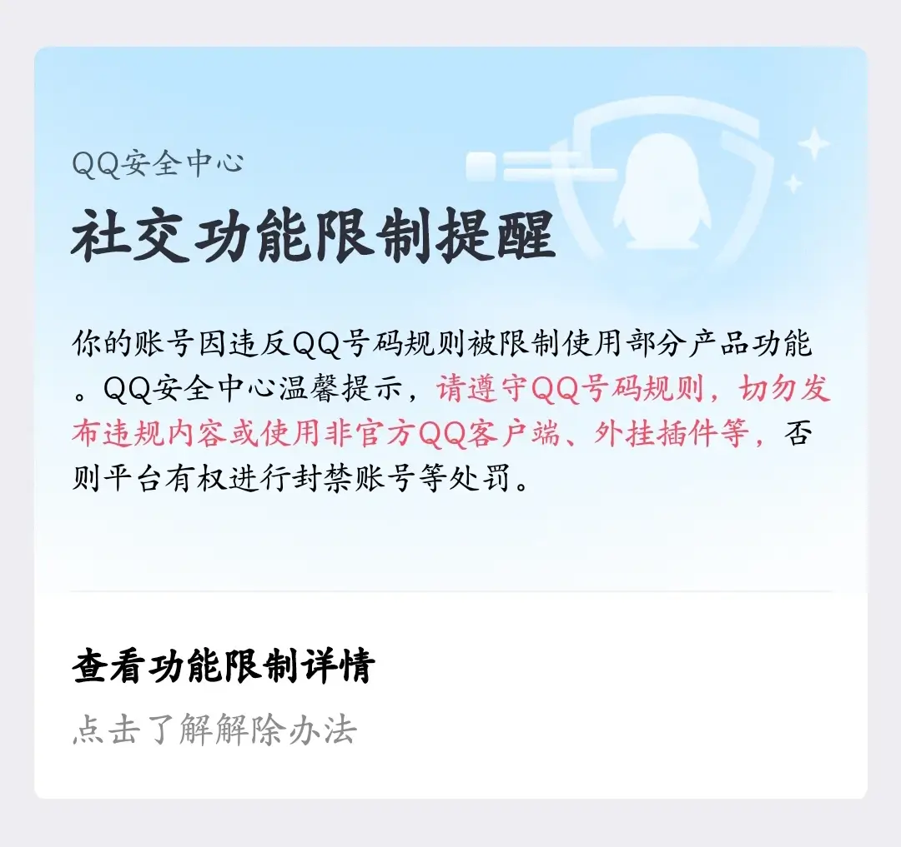
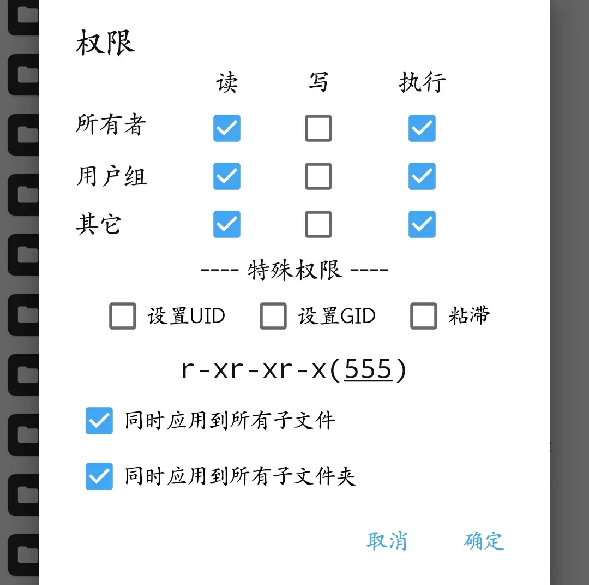
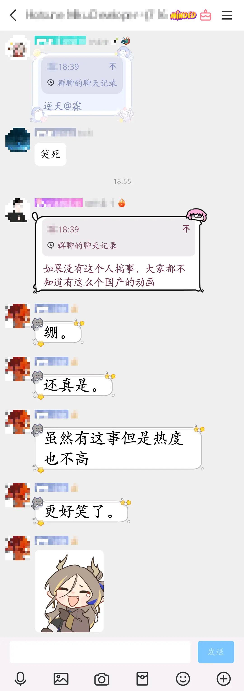

> 此文首发于酷安：  
> [https://www.coolapk.com/feed/62758373](https://www.coolapk.com/feed/62758373?s=MzMwNGEzN2YxNjNjOGZnNjhlOGQ1M2R6a1551)  
> 以后有时间了再搬过来

不需要使用模块插件，也不会修改QQ本体，  
所以很安全不用担心被封号或蓝框警告(如下图)，  

其实楼主以前都是用QA来屏蔽的，但tx最近对插件模块的检测力度一直在加大，  
前段时间被连续封了几次之后，不得不禁用了所有涉及到QQ的模块插件，  
只是没有了QA之后，群里面各种乱七八糟的字体就冒出来了，让本来就有点强迫症的楼主非常不舒服  
所以研究了一下，琢磨出了下面这个方法，过程很简单，  
唯一的难点应该是在于访问安卓Data分区，这个网上有很多教程，root或者adb应该都行，此处不再赘述，  
下面以禁用QQ字体为例，演示一遍操作步骤：  
1. 进入“/data/user/0/com.tencent.mobileqq/files/files/vas_material_folder/font_info/”这个文件夹，把里面的文件全都删完。
2. 返回上一级，即“/data/user/0/com.tencent.mobileqq/files/files/vas_material_folder/”这个路径，找到“font_info”这个文件夹并禁用写入权限(如下图，使用adb命令则是把权限设置为555)。

就这样就行了，  
如果要屏蔽气泡，步骤是一样的，把“font_info”文件夹改为“bubble_dir”文件夹就行，  
屏蔽头像框则是“pendant”这个文件夹，  
屏蔽svip入群动画是“troop_enter_effect”这个文件夹，  
屏蔽svip标识和游戏标识是“namePlate_dir”、“namePlatePendant_dir”、“guideMaterial”、“vipicon_download”、“gamenameplate”这几个文件夹，  
屏蔽新人入群气泡是“newComeCard”这个文件夹，  
屏蔽特殊名片背景是“ProfileCard”这个文件夹，  

其他文件夹懒得看了，如果有还想要屏蔽其他东西的，可以自己去翻文件夹辨别，反正方法都一样的。  
另外这个方法其实还可以自由选择只显示哪些气泡字体，其他的全屏蔽，就是在文件夹里面只保留你想要显示的字体或气泡对应的文件就行，这一点上面，应该比用模块插件来屏蔽的自由程度还要高一些  
不过这个方法也有一个缺点，就是对超大字特效这种暂时没法解决(如下图)，

当然也可能是因为楼主没找到方法，虽然影响不大，不过如果要是有人知道的话，欢迎评论分享一下

