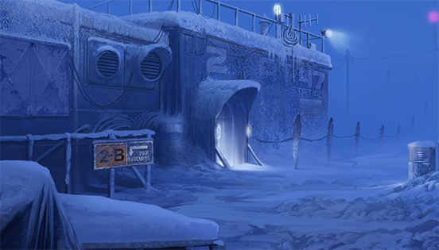
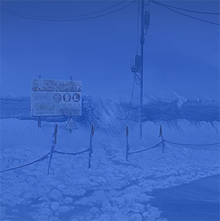
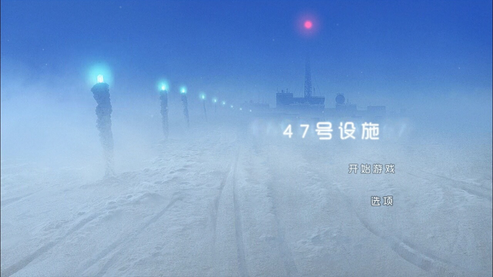

> 此文首发于百度贴吧：[https://tieba.baidu.com/p/5542213291](https://tieba.baidu.com/p/5542213291)  
> 但本网站的排版更佳，更适合阅读，以下为正文内容

> 詹恩的日志  
> 1977年07月11日  
> 我有一个非常了不起的发现。去年我们在基地下方发现了一个冰下湖。之前从未有人发现这些湖，更没想到其中会有生命的存在。我现在已经发现了之前从未被人类发现过的超过100种细菌。  
> 这些细菌中有一种尤其引起了我的巨大兴趣。那是一种食肉细菌，它会攻击小型生物，然后将依附在目标生物的DNA上。就像一种寄生虫一般，从宿主身上吸取养分，但与其他寄生虫不同的地方是，它们产生的养分远超过从宿主处吸取的营养。  
> 我将这种细菌命名为泰坦细菌。它可以将自身免疫功能提升1000倍，创造一种新型抗体，我认为这种抗体可以治愈很多当前医疗无法攻克的疾病。  
> 我会将研究结果写进一篇实验报告中，但在获得更多实验数据前，我不打算公开此发现。这无论对我还是整个人类来说都是一个巨大的惊喜。

> 安德烈亚斯·伍尔夫的日志  
> 1977年07月24日  
> 阿卡塔斯，世界处于领先地位的药物研究公司，以丰厚的薪水邀请我帮助他们进行药物研究。不过遗憾的是，药物研究是在地球上最大的荒漠：南极洲上进行的。  
> 那里极端的低温环境非常适合对高危传染物质的储藏和研究，但我希望那里的环境可以允许我种植一些植物，因为我肯定受不了闷在充斥着循环空气的小隔间里面的生活的。  
> 我可以与伟大的恩格尔曼博士一起工作，这似乎是我的荣幸，不过讽刺的是，我们在学术上互为竞争对手，至今已有十余载。尽管我在学术研究上略胜他一筹，但他总能因其在健康和药物领域不求利益的无私发现赚取更多的关注和赞誉。  
> 我非常期待与他的会面，因为我终于能辨明他是否真如各大报纸所称的那样无私高尚。

> 詹恩的日志  
> 1977年09月22日  
> 今年是对于我们身处47号设施的全体人员来说非常有意思的一年。  
> 今天我们迎来了一位新伙伴，伍尔夫博士，他是一位来自澳大利亚的天才科学家，他的研究领域主要涉及生物学与植物学。  
> 我非常期待可以与别人用德语进行交流，不过说实话，我最近也基本上没有与其他人说过话。  
> 这里的冬季相当孤寂，我当然想念我的家人，但我的研究成果就在眼前了，看在母亲的份上，我舍不得为了回家而弃之不顾。  
> 我的挚友茱莉亚回基地了，这真是太好了。她暂时可以充当家人的角色，在她的协助下，我可以加快实验和数据处理的进程，更别提还有伍尔夫博士的帮助。  
> 另外让我激动的是，明年那位名叫卡尔文·罗兹的传奇探险家将会加入我们的团队，因为他将会挑战只身独闯南极圈。  
> 能会见如此一位勇敢且富有经验的绅士真是太荣幸了，我有太多的事情想要与他一同探讨。  
> 我已经向总部递交了继续留在基地的申请。

> 茱莉亚的日志  
> 1977年09月28日  
> 在英格兰度过了一个美好又温暖的夏天后，我几乎已经忘了这里有多么的寒冷。  
> 我回来之后，几乎不敢相信自己居然能忘了这里的低温。严寒刺穿了所有的保温设备，直击人的血管和骨髓。  
> 我真是不知道詹恩是怎么撑过整个冬天的。他脸色苍白枯槁得可怕，但他看到我归来后露出的微笑还是那样温暖。  
> 我离开的时候非常想念他。不管别人是怎么评价他的，我都认为他是一个好人。如果没有他这种为了帮助他人甘愿牺牲一切的人，那这个世界将会多么糟糕。

> 自：伍尔夫，安德烈亚斯(awolf@f47.net)  
> 至：布罗迪·本杰明(bbrody@f47.net)  
> 1977年11月14日  
> 主题：安全  
> 本杰明，你能花点时间将屋顶楼梯上的电线接到墙上去吗？  
> 现在这样都撂在地上实在太危险了，我已经第二次被绊倒了，差点把脖子摔断。但愿别再有下一次了。  
> ——安德烈亚斯

> 医务室报告：  
> 1977年11月30日  
> 今天本杰明在外修车的时候被严重晒伤，我对他进行了治疗。  
> 治疗最大的难点在于让他平静下来，这家伙的脾气就像一只袋獾一样。  
> 他骂天骂地，骂到青筋暴起，满脸通红，像只煮熟的龙虾一样。  
> 我相信他最气的就是他自己，怎么能一点常识都没有呢。他在这里待的年头和我们一样长。  
> 他一定是以为自己既然能在沙滩上度假，就一定能承受得住南极圈的太阳！他现在看起来就像被安德烈亚斯辐射过的大鼠一样。  
> 总之，我让他接下来休息几天，还给他开了几片止疼药。  
> 他说他会把疼痛感都睡过去的。他请假，整个研究小组都不会开心的，现在有很多设备都等着他维修呢，而且他自从回来之后干劲就不是很高。  
> 不过往好处想想，他现在这绯红的皮肤可够我们茶余饭后笑话很久的了！  
> 茱莉亚·文森特博士

> 自：文森特，茱莉娅(jvincent@f47.net)  
> 至：米勒，艾略特(emiller@f47.net)，恩格尔曼，詹恩(jengelmann@ f47.net)  
> 1977年12月01日  
> 主题：圣诞活动建议  
> 我认为也许我们可以在气象气球上连接一些彩灯，然后去屋顶喝点小酒。你们觉得怎么样？

> 自：米勒，艾略特(emiller@f47.net)  
> 至：[所有]  
> 1977年12月15日  
> 主题：圣诞飞镖锦标赛！  
> 大家好！别忘了明天是圣诞飞镖锦标赛报名截止日期。  
> 我们需要你们提交自己的组名（越帅气越好）和参赛者签名（最少两名参加者，最多四名）。  
> 我们一定会玩得很开心，另外值得一提的是，第一名的奖品是一大瓶朗姆酒哦，此奖品是B.B提供的。

> 日志 > 安德烈亚斯·伍尔夫博士  
> 1978年01月21日  
> 不得不承认，与恩格尔曼博士一起工作确实是一种难得的体验。  
> 恩格尔曼博士是个天才，但警惕心有些强，他不喜欢畅谈自己的研究方法和秘密，但随着对他了解的加深，我发现他展示给我的研究方法，我自己一个人这辈子都不可能想出来的。  
> 我们合作得相当愉快，还有文森特博士，她是一名非常漂亮的英国女士，也是一名不可多得的天才。她协助我们进行研究，遗憾的是她对我根本没有兴趣：我能从她看恩格尔曼的眼神中看出她已经爱上了他。  
> 但那可怜的家伙还一直都没有意识到，他一心都扑在了科学研究中。  
> 要说恩格尔曼博士有什么缺点的话：那就是他逼自己逼得太紧了。我发现他上个冬天就是在基地度过的，一个人全身心扑在了研究中。  
> 我钦佩他的毅力，但人的大脑也需要休息，劳逸结合才能有好效果。  
> 作为爱好，我还在基地中种了一些绿植。我认为一心放在疾病研究上是不健康的。

> FAO组织詹恩·恩格尔曼博士  
> 47号设施  
> 西南极洲  
> 1978年02月06日  
> 亲爱的恩格尔曼博士，  
> 我们很高兴听到你再次决定继续留在基地进行冬季研究的消息。这是第一次有人自愿连续两年进行研究，但听取了我们的精神学团队的建议后，我们认为你不能再在那里跨入第三年的研究。  
> 至于冬季研究任务的薪水，由于项目基金有限，董事会决定不再对连续两年（及以上）身处基地的员工发放奖金。  
> 如果你因为这项决定而放弃冬季的研究，我们表示深刻的理解。  
> 真诚的，瑞秋·常  
> 阿卡塔斯员工联络员

> 自：米勒，艾略特(emiller@f47.net)  
> 至：布罗迪·本杰明(bbrody@f47.net)，伍尔夫，安德烈亚斯(awolf@f47.net)  
> 1978年04月27日  
> 主题：好吓人啊！  
> 我最近夜里在走廊中撞上了艾略特博士，差点吓尿了。他看起来就跟只僵尸一样！  
> 伙计们，他究竟怎么了啊？本，你要不要给他吃个你那种魔法糖果？我觉得这可怜的家伙需要休息一下了。

> 1978年05月18日  
> 亲爱的弟弟，  
> 母亲于昨日去世。写信说这种事情的确太糟糕了，但电话线路过于脆弱，我不想来回重复这个信息。母亲非常坚强，一直在与病魔做斗争，坚持的时间比所有医生预计的都要长，但最终还是没能逃脱死神的魔爪，这种可怕的疾病又夺走了我们的一名至亲。有时候我真觉我们的家族被诅咒了，先是爷爷和奶奶，然后是爸爸，现在妈妈也走了。我不禁觉得接下来就轮到我们了。这是我们的宿命。  
> 我知道你的工作很重要，你想要找到治疗这种疾病的方法，虽然很遗憾，但我还是希望你能回家。你已经三年没有回家看看了，我非常担心你。我实在无法相信你要怎么独自面对这个噩耗，而且我们也需要你回来。求你不要再在那个寒冷的地方过一个冬天了。  
> 诚挚的，你的爱姊，爱丽丝

> 实验室报告:  
> 1978年05月18日  
> A.W.一直对大鼠进行辐射，我们正在等待症状出现。  
> J.E.正在对实验所需的血清进行提纯。  
> 我的任务是观察动物症状并记录下它们在实验前的生理数据。

> 自：恩格尔曼，詹恩(jengelmann@f47.net)  
> 至：伍尔夫，安德烈亚斯(awolf@f47.net)，文森特，茱莉亚(jvincent@f47.net)  
> 1978年05月28日  
> 主题：给冬季任务团队的提议  
> 尊敬的同事们，我希望可以借此机会表达我对你们这几个月来杰出工作的感激，我认为你们应该一致同意我们三位合作得相当愉快。  
> 我有个不情之请，我希望这个冬天你们可以自愿留在研究设施中继续工作。我相信只要我们可以保持现在的劲头，就一定能实现更大的突破。  
> 再次感谢，詹恩·恩格尔曼

> FAO组织本杰明·布罗迪  
> 47号设施  
> 西南极洲  
> 1978年06月05日  
> 亲爱的布罗迪先生，  
> 你之前在一年三次的药物配给中要求安眠药“米氮平”，我们注意到尚未有证据显示你真的需要此药物。  
> 我们理解基地设施条件艰苦，入睡可能是个问题（冬季除外），但我们需要提醒你米氮平有危险的副作用，可能导致使用者失忆，出现幻觉，甚至死亡。  
> 我们知道这一年多来我们一直在向你提供这种药物，我们也感谢你自愿参与冬季任务。  
> 下次的药物供给包中我们还会配给同样分量的米氮平，但你也会注意到下次供给的直升机上会有一位医生，我们派他去判断你是否真的需要服用此药物。  
> 真诚的，瑞秋·常  
> 阿卡塔斯员工联络员

> 自：伍尔夫，安德烈亚斯(awolf@f47.net)  
> 至：文森特，茱莉娅(jvincent@f47.net)  
> 1978年06月07日  
> 主题：詹恩  
> 茱莉娅，我有点担心詹恩。昨天我起夜的时候，走廊里面好冷。我注意到有扇门没有关，我还以为是布罗迪忘了关。  
> 但后来听到外面雪中有些咯吱咯吱的声音，我披上衣服跑到外面去看。我看到詹恩在外面用铲子在挖什么东西。我问他在做什么，他没有理我，继续挖。  
> 我意识到他应该是在梦游，于是将他扶回了床上，他一直都没醒过来。  
> 最奇怪的是，他挖的坑非常深。我觉得昨晚绝不是他第一次起床挖洞。我们得留意一下。我觉得他最近精神一定有些濒临崩溃了。

> 自：伍尔夫，安德烈亚斯(awolf@f47.net)  
> 至：罗兹·卡尔文(crhodes@f47.net)  
> 1978年06月08日  
> 主题：注意？  
> 亲爱的罗兹先生，上次我们开的短会上，我忘记告诉你了，我们的地图室位于2号建筑。  
> 我相信那里会对你的旅程大有助益。

> 自：罗兹·卡尔文(crhodes@f47.net)  
> 至：布罗迪·本杰明(bbrody@f47.net)  
> 1978年06月11日  
> 主题：关于昨夜  
> 嘿，本，听说你的卡车陷进雪里面了，这也有我的一部分责任。我也知道在这种天气下外出实在不安全。  
> 总之，感谢你前来救援，但愿那顶帐篷还算舒适！  
> 幸运的是那里有我的一副扑克。关于这副扑克的来源就说来话长了。我以后写回忆录的时候一定会提到的。

> 自：罗兹·卡尔文(crhodes@f47.net)  
> 至：恩格尔曼，詹恩(jengelmann@f47.net)  
> 1978年06月12日  
> 主题：大米布丁  
> 嘿教授你好啊，最近怎么样？好久没你的消息了，所以我来问候一下。  
> 另外，你上次打牌输了，还欠我一罐大米布丁呢！我想什么时候再跟你和安德烈亚斯打牌呢。  
> 这里的生活实在是太无聊了。要不要周五玩7牌梭哈？

> 自：恩格尔曼，詹恩(jengelmann@f47.net)  
> 至：文森特，茱莉娅(jvincent@f47.net)  
> 1978年06月15日  
> 主题：我们就要成功了  
> 茱莉亚，我们就要成功了，我知道我们就要成功了。  
> 我最近一直都会做挖东西的梦，我敢肯定这象征着我们就要有突破了。  
> 我只需要再对血清做些调整就可以开始试验了。  
> 我觉得我今晚一定睡不着了！

> 实验室报告:  
> 1978年06月29日  
> 介绍：研究过上周的实验结果后，我决定冒险在自己身体上实验泰坦细菌。  
> 我已经像那些大鼠一样接受了辐射，根据我的基因和家族病史，我觉得我有很高的几率已经罹患了癌症。  
> 我现在要将这一切记录下来，如果我没能完成此次试验，这份报告还能留作参考。  
> 方法：我要将已消毒的泰坦样本注射到我的血液当中，观察变化。我会用手术刀切下自己的皮肤，观察愈合时间和失血情况。  
> 结果：注射了血清后，我感觉到身体机能的敏感度提升。头晕了几分钟，无法保持站立。我等身体适应了这种变化后，用手术刀划破了我的手。  
> 不可思议的是，我居然没有观察到任何出血现象，伤口很快就愈合了，总用时甚至不到一分钟。  
> 讨论：我真是不敢相信我居然成功了。我一定要告诉茱莉亚。  
> J.E.

> 茱莉亚的日志  
> 1978年06月30日  
> 我被这个冬天第一场真正的雪暴惊醒。从势头看，这场雪暴应该会持续几天甚至几周时间。  
> 詹恩今天早上来找我的时候神态不同往常，活蹦乱跳的像个孩子一样。他深情地拥吻了我，告诉我他爱我。  
> 他说他在自己身上测试了泰坦，然后感觉还不错。他也给我看了手上的伤口，痊愈后的状态简直让人难以置信。  
> 太疯狂太惊人了，但我真心为他高兴。也许这个冬天之后，我们就能忘掉疾病，忘掉死亡，专注在自己的生活中了。  
> 另外还有一个不太令人高兴的消息，实验室中有一只大鼠咬了另一只，被咬的大鼠伤口感染了。  
> 我们不能再浪费实验资源了，所以把这两只大鼠隔离了起来。  
> 我得小心不能把詹恩的实验告诉安德烈亚斯，詹恩说让我暂时不要跟别人讲。

> 医务室报告：  
> 1978年07月02日  
> 茱莉娅病了。吃过晚饭后，她突然倒在了地板上，剧烈地抽搐。  
> 詹恩，卡尔文和本杰明帮助我将她抬到了医务室，她现在还在医务室室躺着呢。她昏迷不醒，状态迅速恶化。就好像有什么东西在吞噬她一样。  
> 现在我们仍未查明病因，她没有癫痫或糖尿病病史。不过现在一切情况都未定，不能轻易下判断。  
> 她需要紧急救护，我已经让卡尔文和本杰明去寻求帮助了，但现在风暴这么猛烈，我觉得他们一时是找不到人的，就连爬上无线电塔都相当困难。  
> 詹恩和我会轮班照看茱莉娅的。  
> 安德烈亚斯·伍尔夫博士

> 卡尔文的日志  
> 1978年07月07日  
> 哦，英年早逝的茱莉亚...  
> 你去世后，整个基地的状况也急转直下。伍尔夫病死了，我也束手无策了。  
> 我刚刚去看了本的状况，但他已经说不出话了，他只能哀嚎着扭动，皮肤也糟糕得不成样子。我不想离他太近。  
> 詹恩似乎沉浸在悲痛中动弹不得，完全帮不上忙，我也不会医术。无线电也坏掉了，收不到任何回复，我已经决定要离开基地了。  
> 我了解一些关于在极端环境下生存的知识，虽然外面的条件很恶劣，但总比坐以待毙落得本的下场好。  
> 詹恩想要阻止我离开，他觉得我们都需要被隔离起来。我收拾了一些装备，准备向海岸线上的另一个基地前进。  
> 如果有人读到了这张字条，请转告我的妻子和孩子我爱他们。

> 詹恩的日志  
> 1978年07月08日  
> 他们都去世了，都是我的错。  
> 这种泰坦细菌，虽然在我身上效果良好，但对那些没有携带我这种遗传基因的人来说却是致命的。  
> 我吻了茱莉亚，她一定是因为这个才被感染的。我给了她死神之吻。她病了之后我将整个实验室翻了个遍，想要找到数据中的失误。  
> 我找到了一封姐姐的来信，还没有开封就被我丢到了一叠文件下面。上面说我的母亲一个月之前就去世了，我都没来得及见她最后一面。  
> 爱丽丝，茱莉亚，本，安德烈亚斯，卡尔文，对不起。我现在唯一能做的就是用我的生命阻止这场传染的蔓延。  
> 我要将我自己封锁起来，然后将钥匙丢掉...丢到一个我可以永远安眠的寒冷孤寂的地方。

> 你好，E博士，我注意到你的黑眼圈了，我们大家都很担心你的身体。  
> 别太逞强了，我知道你的感觉，我也知道应该怎么办。  
> 我给你留下一包这个，有了这个你就能好好睡一觉了。  
> 一开始只吃半片就够了——药劲很强，你一定明白我的意思的。  
> 不要给我钱了，算我送你的。  
> 多保重，博士  
> 本

> 布罗迪，  
> 我在实验室工作台上放的是腐蚀剂的配方。有了这种腐蚀剂，我就能像用刀切黄油一样将那些破轴搞定了。  
> 那个配方相当简单，所以要调制绝非难事，只是调制过程一定要小心，这种腐蚀剂的效果非常强烈。  
> 你要是进了医务室，我和茱莉娅得浪费多少宝贵时间啊！  
> ——伍尔夫

> 自：密码提示(server@f47.net)  
> 至：恩格尔曼，詹恩(jengelmann@f47.net)  
> 主题：密码提示  
> 你的密码是112267  
> 这是一条系统信息，请勿回复

> 选择条目 >  
> 1. MAIL> 主题：安全  
> 2. MAIL> 主题：詹恩  
> 3. MAIL> 主题：大米布丁  
> 4. 医务室报告> 安德烈亚斯·伍尔夫博士  
> 5. 外部设备状态>  
> [未连接]  
> [驱动程序缺失]  
> [在线]  
> 6. 卡片重写器  
> 7. MAIL> 密码自动提醒  

> 外部驱动状态 >  
> 未连接  
> 已连接，驱动程序缺失。插入磁盘  
> 读取磁盘中...  
> 加密错误  
> 在线  
> 卡片写入器在线>  
> [插入卡片]  
> 卡片覆盖成功  
> LOGIN> 詹恩·恩格尔曼  
> 需要密码验证>  
> \>密码不正确  
> \>是否发送密码提醒？  
> \>密码提醒已发送  
> \>提醒将发送至调查室终端  
> \>打开自动邮件以获取密码。

> 选择条目 >  
> 1. MAIL> 主题：圣诞派对想法  
> 2. MAIL> 主题：昨晚  
> 3. MAIL> 主题：我们就快成功了  
> 4. 操作> B-3实验室远程访问  
> 5. 操作> 玩《北极逃生》

> 运行温度在-5至-3摄氏度之间  
> 设定温度，调整系统，正在等待样本  
> \>分析化合物中…  
> \>已识别化合物：泰坦细菌  
> \>泰坦细菌  
> \>条目1 [1977年12月10日]  
> 已识别泰坦细菌。推测其可能成为癌症疗法。将研发血清，使该细菌可用于啮齿动物测试。  
> \>条目2 [1978年06月27日]  
> 啮齿动物测试已完成。直接注射含泰坦细菌的血清，成功缩小了啮齿动物的癌性肿瘤尺寸。该血清将在更大的哺乳动物身上进行测试。  
> \>条目3 [1978年07月05日]  
> 已确认泰坦细菌对人类具有致命性且传染性极强。所有样本须销毁，避免与感染者接触。已启动隔离与撤离程序。  
> \>【紧急程序】  
> \>实验室隔离  
> \>[已激活]  
> \>净化室封锁  
> \>[已激活]

> 疾病控制中心今天发布了一项全球紧急声明，中国以及北美地区发现了泰坦病毒。  
> 欧洲和非洲的很多地区也已经采取了隔离措施，以防这种致命病原体的扩散。  
> 这种病毒至今已经导致了大约26亿人死亡，死亡人数占世界总人口的三分之二。  
> 目前，研究认为该病毒起源于南极洲的一座研究设施。我们目前仍未研究出治愈或预防方法。  
> 人类一族危在旦夕，我们需要万众一心，众志成城。人类史上最黑暗的时代已经来临。

