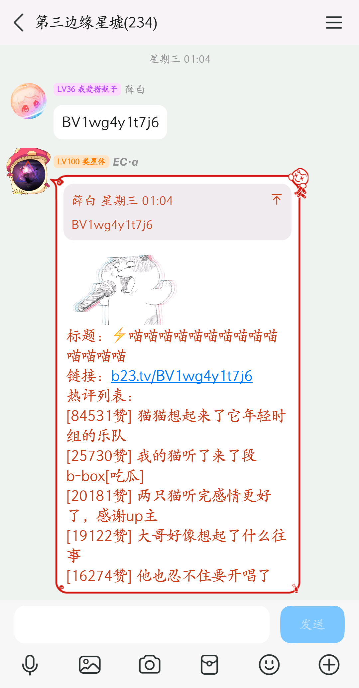

import { Aside, Tabs, TabItem } from 'astro-pure/user'

<Aside type='tip' title='提示'>
这是一个仍在不断完善的文档🤨  
需要注意的是，下面的大部分功能，都是由EC管理员在空闲休息时间里面独自设计、编写、测试、部署和维护的，  
但个人精力有限，EC管理员又不喜欢花太多时间在测试上，所以肯定会存在部分未被发现的功能bug，  
因此各位群友如果在使用过程中发现了疑似bug的问题，请及时提交反馈，否则EC管理员不知道就一直不会处理修复。
</Aside>

## 基础指令

| 指令 | 说明 |
| --- | --- |
| `ec / edgecloud` | <b>EC在线检查</b> |
| `ec<指令 / 菜单 / 帮助 / help>` | <b>EC指令概览</b> |
| `ec功能<状态 / 列表>` | <b>EC功能开关状态查询</b> |
| `ec<启用 / 禁用>[功能名称]` | <b>EC整群开关功能</b> |
| `ec对我<启用 / 禁用>[功能名称]` | <b>EC个人开关功能(仅在对应功能整群状态为启用的情况下有效)</b> |
| `ec永久<忽略 / 屏蔽>我` | <b>警告，此操作不可逆</b>，使用此指令后EC将不再收集统计和处理响应你的任何发言消息(包括指令) |
|  |  |
| `报时` | 时辰报时 |
| `文本转图片[文本内容]` | 文字转图片(默认使用霞鹜文楷字体) |
| `[回复或引用消息]取链接` | 提取所回复消息里面的文件链接(方便手机QQ直接保存表情图片的文件) |
| `[回复或引用消息]设置图片摘要` | 自定义图片消息在QQ主界面消息列表中展示的摘要文字 |
| `[回复或引用EC的消息]撤回` | 让EC撤回自己发送的消息(两分钟内有效) |

<Tabs>
<TabItem label="重要说明">
注1：两个尖括号“\<>”及里面的内容，意思为多选一的固定字符，使用时从里面选择一个进行替换即可。  
注2：两个方括号“\[]”及里面的内容，意思为对应类型的变量，使用时需要自行使用合适的内容进行替换。  
注3：不论是尖括号“\<>”还是方括号“\[]”，其本身在群内实际使用指令时都不需要保留。  
注4：绿色的指令，需要发送者拥有群管理员或更高权限方可使用。
</TabItem>
<TabItem label="操作使用演示图片(部分)">

</TabItem>
</Tabs>

---

## 搜索相关指令

点击展开

<Aside type='note' title='笔记'>
这部分指令功能，虽然很简单且如今几乎无人使用，但却是五年前EC诞生的起因，这也是EC的第一个功能。
</Aside>

| 指令 | 说明 |
| --- | --- |
| `<谷歌 / 百度 / 必应 / 搜狗 / 夸克>搜索 [搜索内容]` | 各大搜索引擎搜索 |
| `<贴吧 / 知乎 / 微博 / 豆瓣 / 小红书>搜索 [搜索内容]` | 部分社交平台搜索 |
| `<nga / github / b站 / 起点 / 乐乎>搜索 [搜索内容]` | 部分论坛网站搜索 |
| `<微信 / 淘宝 / 京东 / steam>搜索 [搜索内容]` | 部分平台搜索 |
| `百科搜索 [搜索内容]` | 萌娘百科搜索 |
| `果核搜索 [搜索内容]` | 果核剥壳搜索 |
| `423搜索 [搜索内容]` | 423Down搜索 |

<Tabs>
<TabItem label="额外说明">
注1：如果你发现某些搜索指令已经失效不再可用，或者希望新增某些(比如搜索引擎/社区/论坛等)快捷搜索指令(仅支持Get方式)，可向EC管理员反馈。
</TabItem>
<TabItem label="操作使用演示图片(部分)">

</TabItem>
</Tabs>

---

## 群数据相关指令

点击展开

<Aside type='note' title='笔记'>
数据统计是EC当前绝大部分功能的核心与基石。
</Aside>

| 指令 | 说明 |
| --- | --- |
| `<今日 / 昨日 / 本周 / 上周 / 本月 / 今年 / 总>发言榜` | 发言排行榜查询(本群+跨群) |
| `连续发言榜` | 连续发言榜(本群+跨群) |
| `积累发言榜` | 积累发言榜(本群+跨群) |
| `近[数字]日发言榜` | 近X日发言榜(本群+跨群) |
| `[数字]月[数字]日发言榜` | 查某一天发言榜(本群+跨群) |
|  |  |
| `综合查询` | 个人数据汇总查询(查询速度慢) |
| `群等级统计` | 群等级统计(本群+跨群) |
| `发言人数统计` | 发言人数统计(本群+跨群) |
| `发言条数统计` | 发言条数统计(本群+跨群) |
|  |  |
| `本群<今日 / 昨日 / 本周 / 上周 / 本月 / 上月 / 今年 / 去年>词云` | 指定时间段的本群词云图片生成 |
| `我的<今日 / 昨日 / 本周 / 上周 / 本月 / 上月 / 今年 / 去年>词云` | 指定时间段的个人词云图片生成 |

<Tabs>
<TabItem label="额外说明">
注1：词云功能由项目[WordCloud](https://github.com/Hellobaka/WordCloud)提供，以较大的日期范围生成词云时，速度较慢，有时候甚至可能会需要三分钟以上的时间，请耐心等待，不要在短时间内连续发送多次词云相关指令。
</TabItem>
<TabItem label="操作使用演示图片(部分)">

</TabItem>
</Tabs>

---

## 图片相关指令

点击展开

<Aside type='note' title='笔记'>
忽略前面的嘉然和动物图吧，让我们一起看看今天的卫星云图和新闻。
</Aside>

| 指令 | 说明 |
| --- | --- |
| `<猫 / 狗 / 鸟>图` | 返回一张对应类型的图片 |
| `嘉然` | 返回一张嘉然的表情包或图片 |
| `嘉然评论区` | 返回一张嘉然评论区的图片 |
| `嘉然小作文` | 返回一张嘉然小作文的图片 |
|  |  |
| `摸鱼日历` | 返回一张摸鱼人日历的图片 |
| `今日新闻` | 返回一张每天60秒新闻的图片 |
| `今日天气` | 中央气象台天气简报 |
| `今日热榜` | 各平台热搜榜单聚合展示 |
|  |  |
| `云图中国` | 风云4号卫星中国区域云图 |
| `云图地球` | 风云4号卫星地球全圆盘云图 |
| `云图中国视频` | 中国区域云图近24小时变化视频 |
| `云图地球视频` | 地球全圆盘云图近24小时变化视频 |

<Tabs>
<TabItem label="额外说明">
注1：这部分指令由EC·β处理，没有EC·β的群无法使用。  
注2：对于单个QQ，以上指令限制每分钟使用一次。
</TabItem>
<TabItem label="操作使用演示图片(部分)">

</TabItem>
</Tabs>

---

## 娱乐相关指令

点击展开

<Aside type='caution' title='警告'>这里的指令很容易让其他群友跟风使用刷屏，请谨慎决定是否在群内使用</Aside>

| 指令 | 说明 |
| --- | --- |
| `漂流瓶` | 漂流瓶功能指令 |
| `今日运势` | fortune今日运势(每天05:00后可用) |
| `今日运势排行榜` | fortune今日运势排行榜 |
| `今日<老婆 / 老公>` | 一群一天一夫一妻制群老婆(随机抽取) |
| `<结婚 / 民政局 / 群老婆>列表` | 群老婆列表 |
| `今天吃什么` | 今天吃什么(根据当前时间返回结果) |
| `早 / 早安 / 早上好` | 早安指令(每天04:00-12:00可用) |
| `晚 / 晚安 / 晚上好` | 晚安指令(每天18:00-次日4:00可用) |

<Tabs>
<TabItem label="额外说明">
注1：这部分指令由EC·β处理，没有EC·β的群无法使用。  
注2：以上部分指令需要群管理员通过开关类指令进行启用后方可使用。
</TabItem>
<TabItem label="操作使用演示图片(部分)">

</TabItem>
</Tabs>

---

## 群管相关指令

点击展开

<Aside type='note' title='冷知识 '>
当你被禁言后，可以在群里发送指令“解禁我”让EC帮你解除禁言状态，  
慷慨的EC是不会拒绝帮助群友的，当然，前提是EC得有群管理员权限。
</Aside>

| 指令 | 说明 |
| --- | --- |
| `禁我[禁言时间(见注1)]` | 自助禁言 |
| `解禁我` | 自助解禁 |
| `禁言[@群友][禁言时间]` | 禁言群员 |
| `随机禁言[@群友][禁言时间]` | 随机禁言群员 |
| `<解禁 / 解除禁言>[@群友]` | 解除禁言 |
| `踢[@群友]` | 踢出群员 |
| `永久踢[@群友]` | 永久踢出群员 |
| `改名片[名片内容]` | 改自己名片 |
|  |  |
| `申请头衔[头衔内容]` | 申请群头衔 |
| `给头衔[@群友][头衔内容(可不填)]` | 给群头衔 |
| `上管理[@群友]` | 增加群管理员 |
| `下管理[@群友]` | 取消群管理员 |
|  |  |
| `投票禁言[@群友][禁言时间]` | 发起投票禁言 |  
| `投成票[投票编号]` | 投赞成票 |  
| `反对票[投票编号]` | 投反对票 |  
| `弃权票[投票编号]` | 投弃权票 |  
| `乐子票[投票编号]` | 投乐子票 |  
| `一票否决票[投票编号]` | 投一票否决票 |

<Tabs>
<TabItem label="额外说明">
注1：以上所有指令，均需要EC拥有群管理员或更高权限方可使用。  
注2：绿色的指令，需要发送者拥有群管理员或更高权限方可使用。  
注3：上面的[禁言时间]变量，单位为分钟，最大值为43200，超出43200按43200算，均可以不填，有默认值。  
注4：上面的[@群友]变量，均支持同时@多个群友。
</TabItem>
<TabItem label="操作使用演示图片(部分)">

</TabItem>
</Tabs>

---

## 其他功能及杂项

### 点歌相关指令(外部项目)

点击展开

<Aside type='note' title='笔记'>
以下点歌相关的指令，都需要加空格，语言点歌会比较慢，需要等一下。
</Aside>

| 指令 | 说明 |
| --- | --- |
| `点歌 [歌曲名] [歌曲作者名(选填)]` | 点歌(自动搜索所有源并选择最佳来源) |
| `语音点歌 [歌曲名] [歌曲作者名(选填)]` | 以语音的形式点歌(转码速度慢，可能失败) |

<Tabs>
<TabItem label="额外说明">
注1：对于只用歌曲名搜不到自己想要的歌曲的情况，在歌曲名后面加上歌曲作者名就能更精确的查找了。  
注2：点歌功能由项目[MiraiSongPlugin](https://github.com/khjxiaogu/MiraiSongPlugin)提供。
</TabItem>
<TabItem label="操作使用演示图片(部分)">

</TabItem>
</Tabs>

### 学习词条相关指令(外部项目)

点击展开

<Aside type='note' title='笔记'>
一个能够让群友给EC添加自定义指令和返回内容的功能。
</Aside>

| 指令 | 说明 |
| --- | --- |
| `学习词条#[词条名]#[词条内容 / 回复项]` | 学习一个新的词条内容 |
| `[词条名]` | 查看对应词条内容 |
| `删除词条#[词条名]#[版本号]` | 删除一个词条，省略版本号则删除整个词条名 |
| `搜索词条#[关键词]#[页码]` | 检索与关键词有关的所有词条，页码为可选项，只可填写数字，默认为1 |
| `词条别名#[词条名]#[目标]` | 添加词条的别名至目标，若不填写目标，则认为是删除名为词条名的别名 |
| `词条历史#[词条名]#[页码]` | 查看词条修改历史，页码为可选项，只可填写数字，默认为1 |
| `全部词条#[页码]` | 检索所有词条，页码为可选项，只可填写数字，默认为1 |

<Tabs>
<TabItem label="额外说明">
注1：此功能危险级别较高，且部分通过此功能添加的指令，可能会被误认为是EC官方的指令，容易导致冲突矛盾，请群管理员慎重决定是否启用此功能。  
注2：学习词条功能由项目[EntryLib](https://github.com/BillYang2016/entrylib)提供，此项目已经停更多年，目前存在部分bug(比如无法存储图片和语音)。
</TabItem>
<TabItem label="操作使用演示图片(部分)">

</TabItem>
</Tabs>

### B站动态更新通知推送(外部项目)

点击展开

<Aside type='note' title='笔记'>
此功能是一个大佬写的，UI非常美观，只有EC管理员很遗憾没有热评。
</Aside>

| 起点更新通知推送订阅指令列表 |
| --- |
| `b站动态更新通知推送订阅查询` |
| `添加b站动态更新通知推送订阅[b站用户UID]` |
| `取消b站动态更新通知推送订阅[b站用户UID]` |
| `搜索b站动态[动态ID]` |
| `获取b站最新动态[b站用户UID]` |

<Tabs>
<TabItem label="额外说明">
此功能默认禁用，启用后的效果为：  
当群内订阅的B站用户更新了动态(包括直播和视频等)之后，EC会在群内发送动态更新通知。

_注1：此功能由项目[BilibiliDynamicMiraiPlugin](https://github.com/Colter23/bilibili-dynamic-mirai-plugin)提供_
</TabItem>
<TabItem label="操作使用演示图片(部分)">

</TabItem>
</Tabs>

### 起点小说更新通知推送

点击展开

<Aside type='note' title='笔记'>
起点的反爬实在是很严格，EC目前是通过循环获取书架数据来判断更新，  
但此方案其实也不是特别稳定，如果有大佬有更好的方案，欢迎联系EC管理员讨论。
</Aside>

| 起点更新通知推送订阅指令列表 |
| --- |
| `起点更新通知推送订阅查询` |
| `添加起点更新通知推送订阅[书籍ID]` |
| `取消起点更新通知推送订阅[书籍ID]` |
| `[回复引用]以后艾特我` |
| `[回复引用]以后不用艾特我` |

<Tabs>
<TabItem label="额外说明">
此功能默认禁用，启用后的效果为：  
当群内订阅的起点小说更新新章节之后，EC会在群内发送章节更新通知，同时允许群友将直接加入EC的艾特通知列表。

注1：此功能仅建议更新时间不规律且每天更新次数不多的书籍使用。  
注2：增删艾特之所以需要回复引用更新通知消息，是因为EC需要通过引用消息的内容来判定具体是那本书需要增删艾特。  
注3：由于起点的反爬策略严格，EC只能每分钟检查一次更新，因此当最新章节更新后，群内的起点更新通知推送可能会有1-60秒左右的延迟。  
注4：在书籍列表已有的书籍，可直接通过书籍ID添加订阅，如果需要订阅列表中没有的书籍，需要把书名提供给EC管理员进行添加。
</TabItem>
<TabItem label="操作使用演示图片(部分)">

</TabItem>
</Tabs>

### 小程序转文本(不含B站小程序)

点击展开

<Aside type='note' title='笔记'>
EC的管理员很讨厌小程序，但更多的群友却已经接受了小程序，因此这个功能也就不再默认启用。
</Aside>

<Tabs>
<TabItem label="额外说明">
此功能默认禁用，启用后的效果为：  
在群友往群内分享了知乎、微博之类的小程序消息时，EC会返回对应的网页链接，使有需要或者讨厌小程序的群友能够选择不打开小程序直接通过链接在网页浏览。
</TabItem>
<TabItem label="操作使用演示图片(部分)">

</TabItem>
</Tabs>

### B站视频解析(含B站小程序)

点击展开

<Aside type='caution' title='警告'>
不要问EC管理员能不能取消展示热评，因为他就是为了展示热评才写的这个功能。  
不喜欢可以直接禁用此功能，对全群或对个人都是可以设置禁用的。
</Aside>

<Tabs>
<TabItem label="额外说明">
此功能对群默认禁用，但个人可以通过@EC 使用，启用后的效果为：  
在群友往群内分享了B站视频的链接、BV号或小程序消息时，EC会返回对应的干净链接和前三个热评，方便群友快速了解视频内容和去除B站默认分享链接里面的追踪参数。
</TabItem>
<TabItem label="操作使用演示图片(部分)">

</TabItem>
</Tabs>

### 火星检测(单群重复消息检测)

点击展开

<Aside type='note' title='笔记'>
如果你还不知道火星是什么意思，请点击查看[《火星管理处罚条例》](https://www.byx2020.com/posts/mars-law)。
</Aside>

<Tabs>
<TabItem label="额外说明">
此功能默认禁用，启用后的效果为：  
在群友往群内发送非表情图片、视频或聊天记录消息时，  
EC会存储对应消息的发送人、发送时间和md5值到火星数据库，  
然后在群友回复某条消息“火星”或“火星检测”时，获取回复消息的md5值，  
在火星数据库中检测是否有其他群友在之前已经发送过了相同的消息，并给出记录列表。
</TabItem>
<TabItem label="操作使用演示图片(部分)">
待补充
</TabItem>
</Tabs>

### 每日定时推送功能

点击展开

<Aside type='caution' title='警告'>
机器人在短时间内主动向多个群发送消息，在腾讯系统里面其实是一个高风险的行为，  
因此即便是启用了此功能的群，如果昨日的群发言数不能达标，EC次日也不会进行推送,  
以此尽量减少推送群的数量。
</Aside>

| 推送类型 | 每日推送时间 |
| --- | --- |
| 每天60S新闻图片+云图视频推送 | 08:22左右 |
| 中央气象台今日天气简报推送 | 09:00左右 |
| 群聊发言榜图片+词云图片定时推送 | 22:00左右 |

<Tabs>
<TabItem label="额外说明">
以上三个推送类型均默认禁用，启用且昨日群发言数达标后次日才会推送，效果为：

定时发送以上类型的内容
</TabItem>
<TabItem label="操作使用演示图片(部分)">

</TabItem>
</Tabs>

### 入群退群相关事件推送功能

点击展开

<Aside type='note' title='笔记'>
这部分的文案，其实都是可以自定义的。
</Aside>

| 推送类型 |
| --- |
| 入群欢迎 |
| 申请入群 |
| 踢出提示 |
| 退群欢送 |

<Tabs>
<TabItem label="额外说明">
以上推送类型对大部分群友均默认禁用，启用后的效果为：

对发言数达标或已经加入过隔壁群的群友，会在其入群或退群的时候，额外生成一张综合查询图片
</TabItem>
<TabItem label="操作使用演示图片(部分)">

</TabItem>
</Tabs>

---

## 图库相关指令(暂不可用，待重构)

点击展开

<Aside type='danger' title='错误'>别看了，没修好😡</Aside>

| 指令 | 说明 |
| --- | --- |
| `图库列表` | 查看所有图库名 |
| `创建图库[图库名]` | 创建本群图库 |
| `创建跨群图库[图库名]` | 创建跨群图库 |
| `删除图库[图库名]` | 删除本群图库 |
| `删除跨群图库[图库名]` | 删除跨群图库 |
| `图库[图库名]增加上传黑名单<@群友 / QQ号>` | 增加图库上传黑名单 |
| `图库[图库名]删除上传黑名单<@群友 / QQ号>` | 删除图库上传黑名单 |
| `图库[图库名]增加提取黑名单<@群友 / QQ号>` | 增加图库提取黑名单 |
| `图库[图库名]删除提取黑名单<@群友 / QQ号>` | 删除图库提取黑名单 |
| `上传图库[图库名][图片]` | 上传图库图片(优先上传到本群图库) |
| `上传跨群图库[图库名][图片]` | 上传跨群图库图片(直接上传到跨群图库) |
| `提取图库[图库名]` | 提取图库图片(优先从本群图库提取) |
| `提取跨群图库[图库名]` | 提取跨群图库图片(直接从跨群图库提取图片) |
| `查询图库[图库名]` | 查询图库数据(优先查询本群图库) |
| `查询跨群图库[图库名]` | 查询图库数据(直接查询跨群图库) |

<Tabs>
<TabItem label="额外说明">
注1：图库内的图片均为群友自行上传，与EC无关。  
注2：图库名仅允许为2~20个字符(一个汉字占两个字符)的汉字、字母、数字或下划线。  
注3：禁止上传违规图片，违者将被列入图库功能的黑名单。  
注4：上传图库指令后面可直接加上图片，也可以先发指令再发图，支持连续上传多张图片。  
注5：“优先本群图库”是指，当存在同名的本群图库和跨群图库时，会优先匹配返回本群图库的结果，而不会返回跨群图库的结果，只有当不存在本群图库时，才会返回跨群图库的结果。
</TabItem>
<TabItem label="操作使用演示图片(部分)">
待后续补充
</TabItem>
</Tabs>

---

