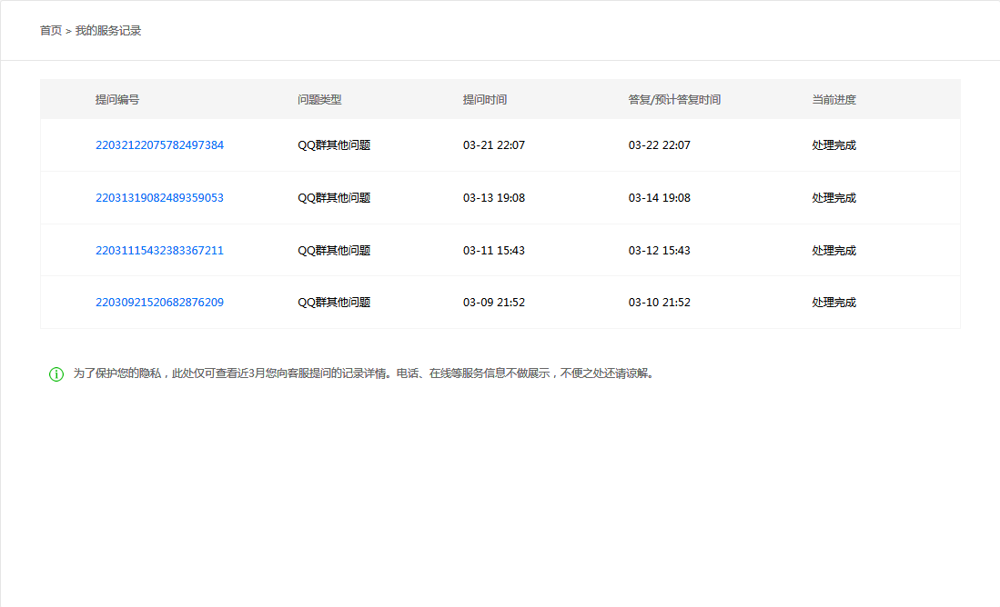
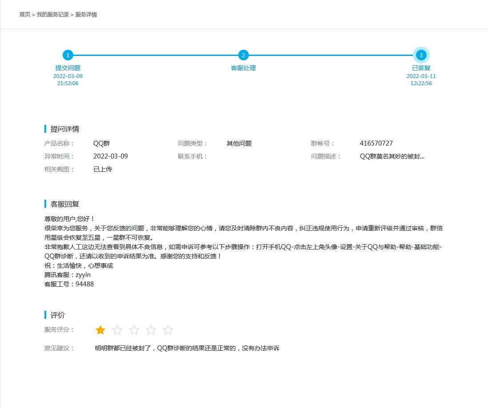
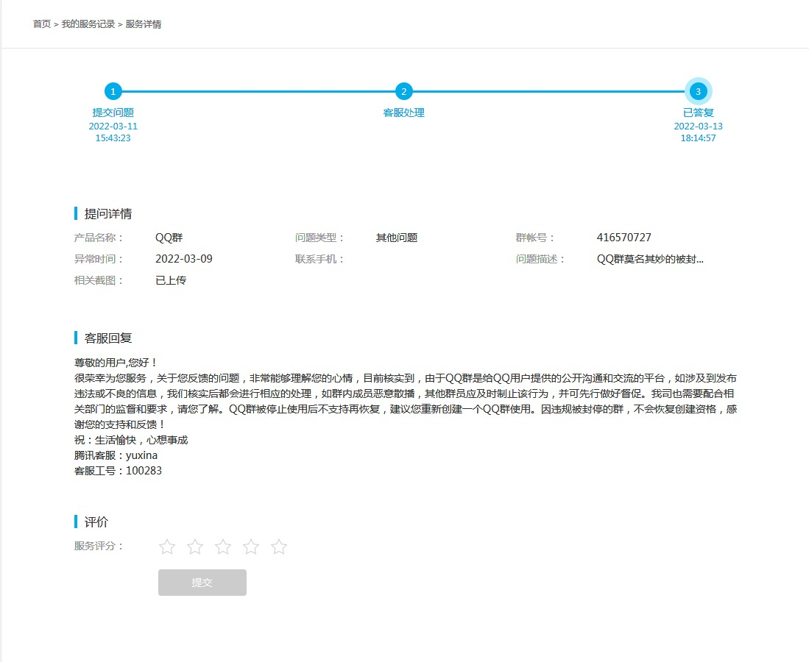
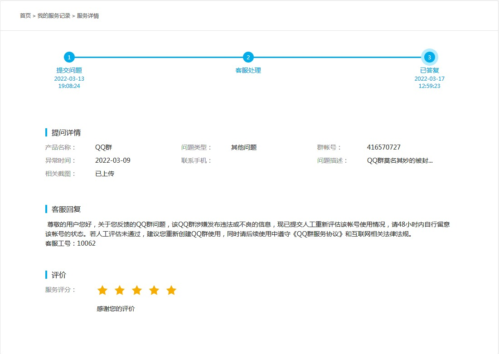
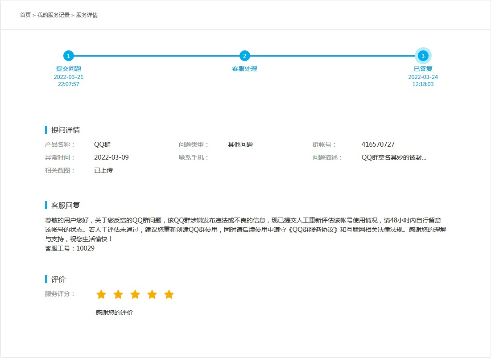
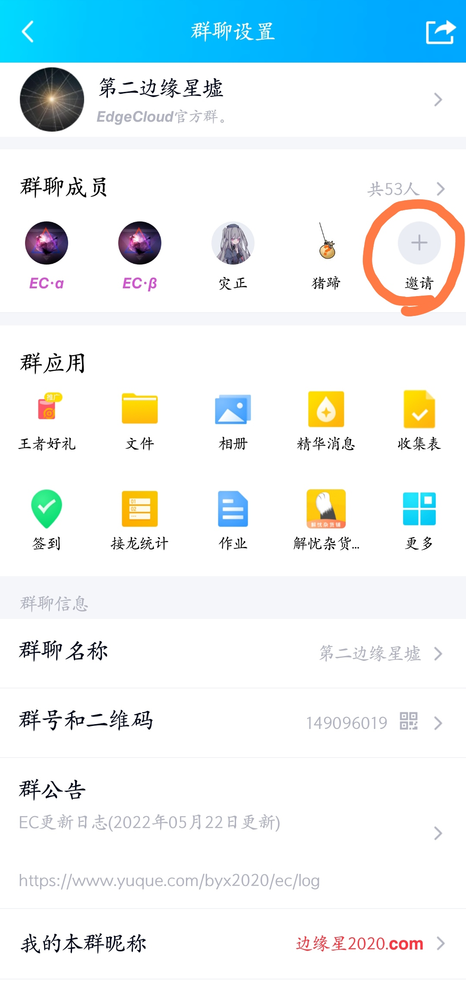
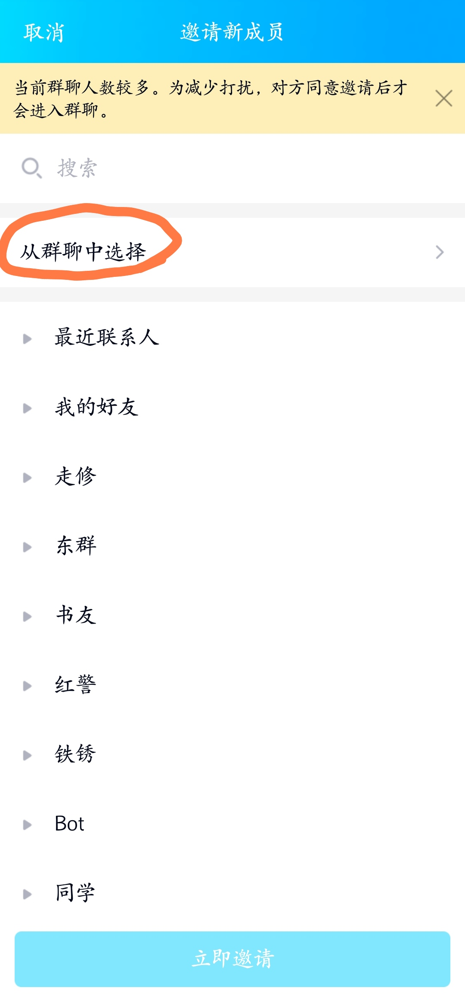
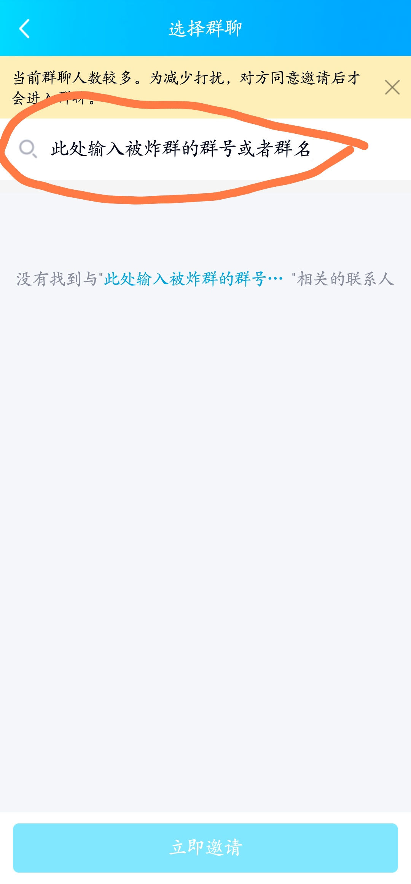

Q群状态查询(限群主可用)：[https://kf.qq.com/self_help/qq_group_status.html](https://kf.qq.com/self_help/qq_group_status.html)

Q群被封申诉渠道一(需要在手机QQ内打开)：

[https://kf.qq.com/touch/bill/220304selfqa47acdd65.html](https://kf.qq.com/touch/bill/220304selfqa47acdd65.html)

Q群被封申诉渠道二(腾讯客服QQ小程序，需要在手机QQ内打开)：[http://m.q.qq.com/a/s/bae355c1e50beed2a81c9be3304510c5](http://m.q.qq.com/a/s/bae355c1e50beed2a81c9be3304510c5)

Q群被封申诉渠道三(如果上面的不可用再用这个，需要在手机微信内打开)：[https://open.weixin.qq.com/connect/oauth2/authorize?appid=wxc8cfdff818e686b9&redirect_uri=https%3A%2F%2Fkf.qq.com%2Ftouch%2Fbill%2F220304selfqa47acdd65.html%3Faction_id%3D165762267410071%26pass_ticket%3DmCpVJn277OSqUKTJy1hWX9Usk80oYaTJVaIksbo80n6X7z%252BLK%252ByzEhqCqSq7BhHD&scope=snsapi_base](https://open.weixin.qq.com/connect/oauth2/authorize?appid=wxc8cfdff818e686b9&redirect_uri=https%3A%2F%2Fkf.qq.com%2Ftouch%2Fbill%2F220304selfqa47acdd65.html%3Faction_id%3D165762267410071%26pass_ticket%3DmCpVJn277OSqUKTJy1hWX9Usk80oYaTJVaIksbo80n6X7z%252BLK%252ByzEhqCqSq7BhHD&scope=snsapi_base)

---

上面两个是申诉过程中需要用到的两个链接。

第一个Q群状态查询链接，比较简单而且用处不是特别大(个人体验)，所以就不多说了，使用被炸群群主账号登录并按照提示输入群号进行查询等操作即可，总之最后能看到的结果有三种，分别是群状态异常、群状态正常和提示没有查询权限(即便你是用的被炸群群主账号登录，这个是腾讯的问题，可以多试几次)，不过不管是那个结果(我遇到的是第二种和第三种)，群被封了都是事实，所以进行下一步，申诉。

第二个[腾讯客服QQ小程序链接](http://m.q.qq.com/a/s/bae355c1e50beed2a81c9be3304510c5)，在手机QQ上打开后，先“选择产品”点进去选择“QQ群”，然后“问题类型”选择“QQ群被封”，其他的如实填写就好，当然，还有一种情况是，在你看到这篇文章时，发现没有上面这两个选项了(有时候腾讯会关闭QQ群的申诉渠道，我遇到过)，此时选择意思最贴近的选项或者改用[Q群被封申诉微信渠道](https://open.weixin.qq.com/connect/oauth2/authorize?appid=wxc8cfdff818e686b9&redirect_uri=https%3A%2F%2Fkf.qq.com%2Ftouch%2Fbill%2F220304selfqa47acdd65.html%3Faction_id%3D165762267410071%26pass_ticket%3DmCpVJn277OSqUKTJy1hWX9Usk80oYaTJVaIksbo80n6X7z%252BLK%252ByzEhqCqSq7BhHD&scope=snsapi_base)也是可以的。

另外，关于“问题描述”和“相关截图”这两项，需要注意的是，在“问题描述”里面你一定要着重强调必须要让客服进行人工复审，否则让机器审核肯定是没有恢复群的希望的，至于“相关截图”，如果你在第一个Q群状态查询链接里面查询的结果是正常的话，可以把页面截图放进去，如果结果是异常的，也不要紧，随便放其他图都行，这个“相关截图”个人感觉其实没什么用。

在你提交申诉之后，腾讯通常会让你等几天客服才会回复，在这期间不建议重复申诉，通常第一次申诉的结果都是失败的，不过也不要气馁，我也是申诉了四次，花了大半个月的时间，最后才成功恢复了群，最后祝大家都能成功恢复自己的群。

最后，补充一个找回被炸群群友的方法，首先你需要建一个新群，然后进入群聊设置界面，点击“邀请”

再点击“从群聊中选择”

然后输入被炸群的群号或者群名，再点击对应的结果，即可进入选择群友的界面

这个方法在电脑上也是可用的，原理都是一样。

附：

 QQ群抢救工具：帮你找到封禁群中成员联系方式

[https://www.bilibili.com/video/BV1244y1c7i5](https://www.bilibili.com/video/BV1244y1c7i5)

