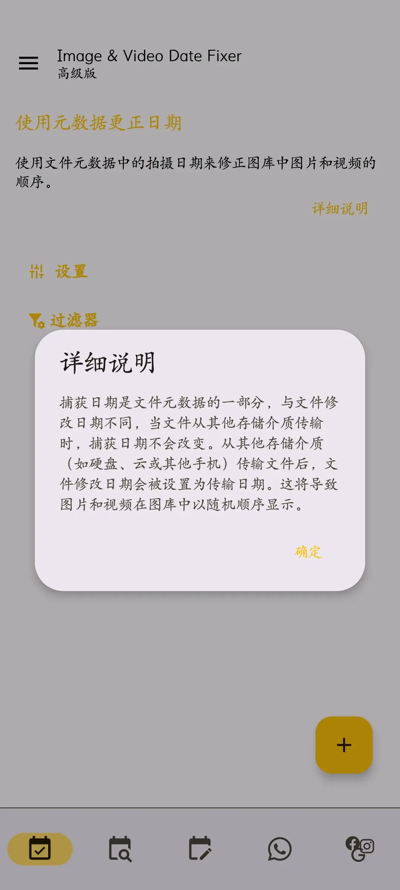
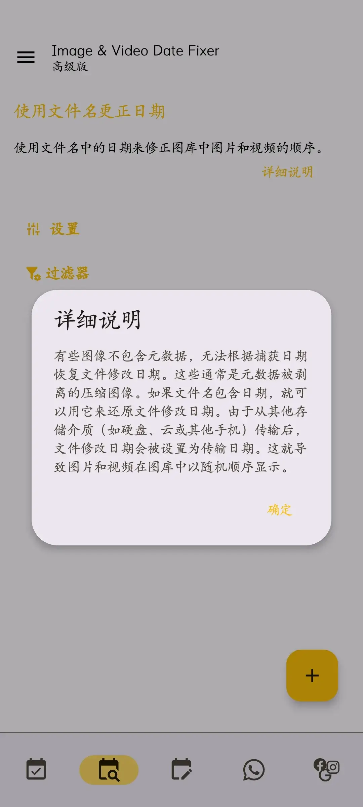

import { Collapse } from 'astro-pure/user'

从云端备份下载大量图片，或将大量图片从电脑传到到手机后，然后发现这部分图片视频在手机相册中的排序完全混乱了，估计很多人都遇到过类似的问题， 
之所以会出现这种问题，是因为图片视频文件在下载和传输的过程中，文件的修改时间被更新为了传输完成时的时间，而非原来的修改时间， 

而Image & Video Date Fixer EXIF正是为了解决这个问题而开发的，它可以通过图片文件Exif信息里面的拍摄时间来恢复修正图片文件正确的修改时间，进而让图片能够在手机相册里面按照正确的排序展示， 
而且对于图片文件里面没有Exif信息但文件名里面带有日期时间或时间戳的图片文件，还可以通过文件名来恢复修正文件的修改时间，也支持手动编辑图片文件的时间日期，还你一个整齐有序的相册图片列表， 

最后附上Image & Video Date Fixer EXIF工具的下载方法，有谷歌商店的，直接搜名字就行，不过免费版有限制，也可以到我的个人网盘里面下载解锁版， 
另外，有整理相册需求的，推荐将本工具和Aves相册搭配使用，具体可以见我的上一篇文章。 

Image & Video Date Fixer EXIF 信息修复 - 2.21.5丨解锁版：https://vxv.ongridea.com/ImageVideoDateFixerEXIF

