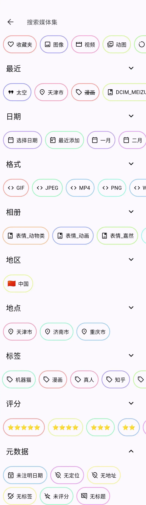
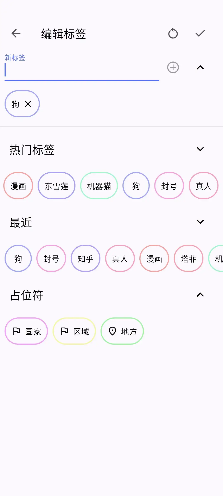

import { Collapse } from 'astro-pure/user'

平时存的各种图片和表情包成千上万无所不包， 
但在要用的时候，在手机上急急忙忙翻了十几分钟图库，却怎么也找不到想用的那张图， 
这样的经历，我已经数不清遇到过多少次了，可能也是每一个喜欢存图的人都会遇到的难题， 

早些年我为了解决这个问题，使用的是文件夹分类法，就是按图片的来源、内容进行简单分类，把不同类型的图片分别放到不同的文件夹里面， 
刚开始的时候确实有点用，但随着时间推移，我存的的图片越来越多，每个文件夹里面的图片也越来越多，想解决就得使用更细化的分类，建更多的文件夹，以至于到了后期，我光是存放图片的文件夹就有二十多个， 

但这还并不是文件夹分类法最大的问题，真正致命的是，在使用了更细化的分类之后，很容易会出现一张图片符合多种分类的情况， 
比如我有一张图片，同时符合表情包、二次元、红警三个分类，即便我决定了放到其中一个分类的文件夹里面，但在需要使用的时候，却又总会找错文件夹，导致浪费很多时间， 

文件夹分类法的这个局限性让我感到很不满意，所以我这些年一直在寻找一个能够像Pixiv网站那样给图片添加标签以方便查找的相册图库软件， 
但比较遗憾的是，国内除了一个个人开发的标签相册，目前主流厂商的安卓图库app，几乎没有一个是支持给图片添加标签的，确实有点奇怪，这应该不是一个很难开发的功能，而且应该也算是比较实用的，不知为何却一直没人做， 

直到前段时间，我才找到了这个支持图片标签的Aves相册， 
与很多着重于展示、编辑或备份图片的常规安卓图库应用不同的是，Aves相册更专注于导航和搜索，让用户能够在大量图片里面快速找到自己需要的图片， 
同时Aves相册可以批量为多个图片添加多个标签，并可通过标签、日期、格式、地点、元数据等多种检索方式来正向、反向、联合查找图片，几乎可以说是手机检索图片的天花板， 

此外值得一提的是，根据我查到的资料来看，目前能给图片添加标签的手机相册应用，好像大部分都是IOS应用和一些NAS的相册应用，安卓可用而且开源免费的似乎也只有Aves相册， 
而且Aves相册记录图片标签的方法是将标签信息写入到对应图片文件的Exif信息内，相对于其他同类型相册应用仅在自己的应用数据库内记录图片标签信息的方法，在图片文件内存放图片标签信息的方法无疑是更安全的，只要图片文件还在，标签信息就不可能丢失，不会因为相册应用的问题导致标签信息丢失， 
而且由于图片标签信息都在图片文件内，哪怕在未来出现了更好的其他支持标签的手机相册应用，你想要更换都不需要额外做什么，直接用就行， 
因为其他标签相册应用只要按照公开的标准来，都能直接读取Aves相册存放在图片文件里面的Exif标签信息数据，所以标签数据也是可以无缝迁移同步到新相册应用里面的， 
这就是开源项目Aves相册最大的优势，更安全、更开放、更兼容，不会像某些软件为了赚钱，故意增加迁移成本，把用户的信息死死锁在自己的应用内，连用户自己都无法导出， 

不过Aves相册这种在图片文件记录标签的方法也有一个小缺点，虽然不会影响到图片本身，但毕竟修改了图片文件的Exif信息，因此会导致图片文件的修改时间发生变化，而很多应用在浏览图片列表时又都是通过图片文件的修改时间来排序的，所以修改了标签的图片，在其他应用里面的排序可能会发生变化(Aves相册默认是通过图片的拍摄时间来排序，所以不受影响)， 

关于这个问题，我和Aves相册的项目作者Thibault Deckers在GitHub上来回沟通过好几次， 
他认为Aves作为一个相册应用，没有也不应该越权去使用文件管理器的权限来编辑图片文件的修改时间(这可能和谷歌应用商店软件规范有关)，否决了我的在编辑图片标签时同步修改图片文件修改时间的建议， 
不过他赞同并应用了我提出的替代方案，也就是现在Aves相册会在对图片执行标签编辑时，同步将图片文件的修改时间也写入到Exif信息里面没有拍摄时间的图片文件里面， 
如此，便可通过Date Fixer EXIF之类的应用软件来一键恢复修正图片文件的修改时间(可参考我的下一篇文章[《图片视频文件修改时间恢复工具推荐 》](https://www.byx2020.com/posts/app-recommendation-aves-date-fixer-exif))，也算是侧面解决了这个问题， 

以上就是我个人在手机相册图片整理方面的一些经验，希望能够帮到有需要的人。 

最后附上Aves相册的GitHub地址：https://github.com/deckerst/aves

