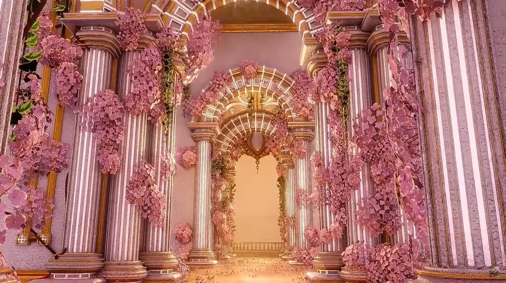
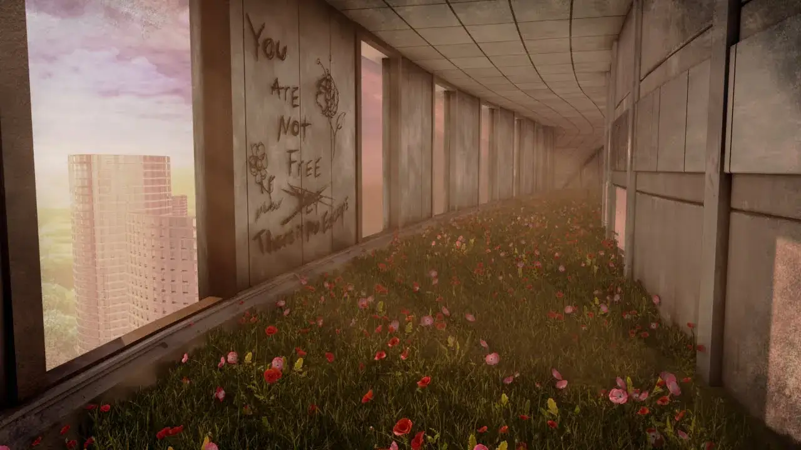
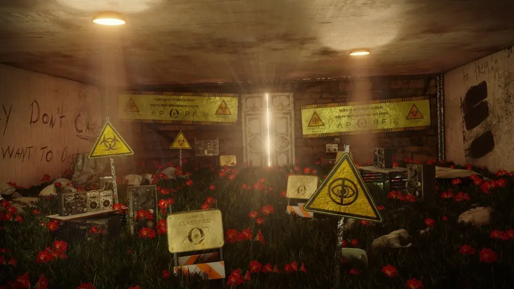
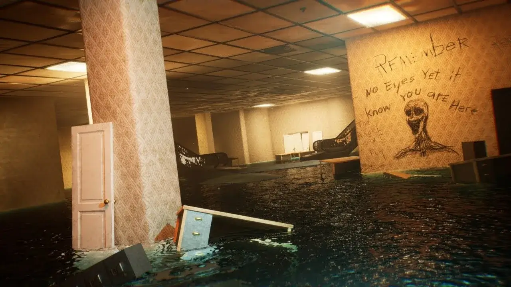
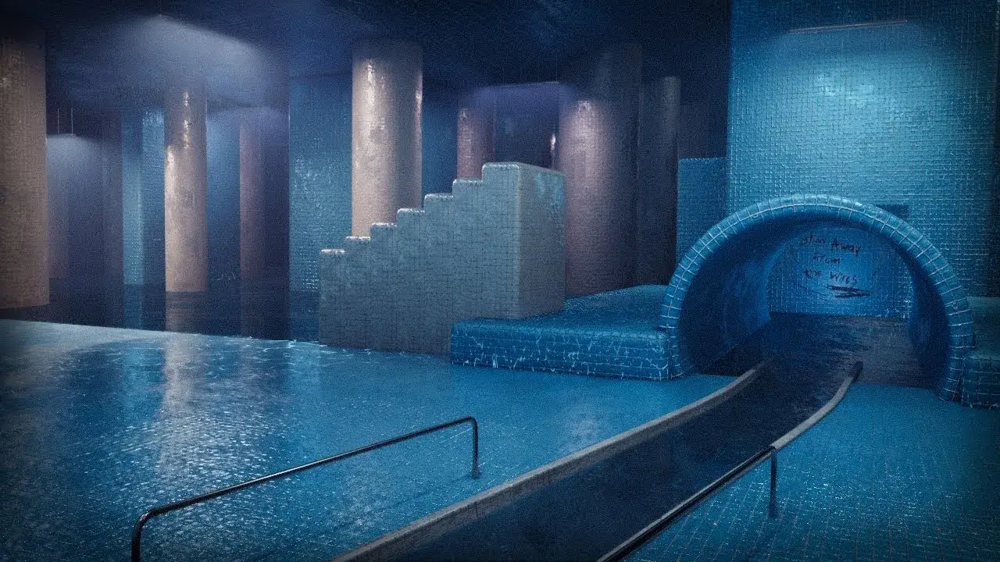
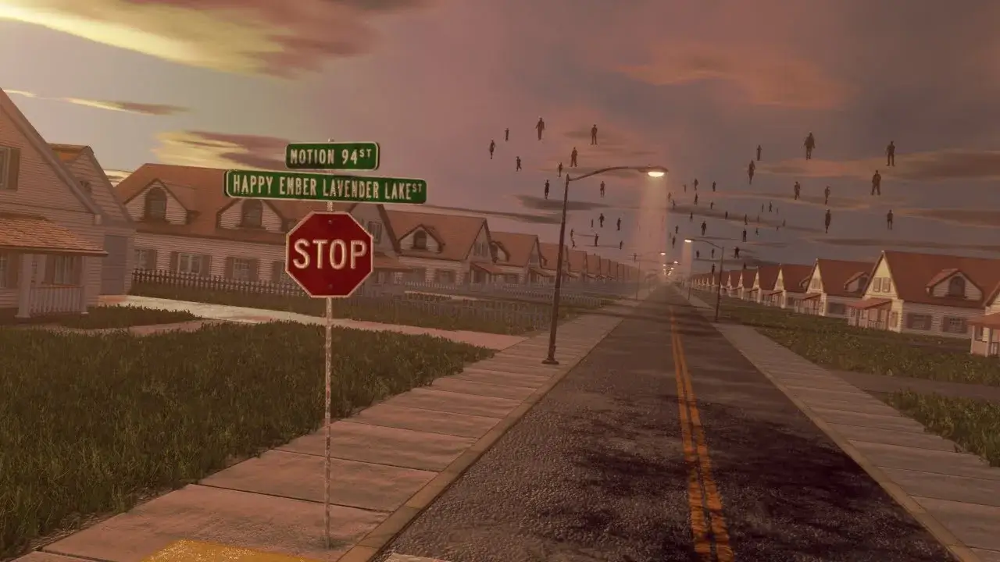
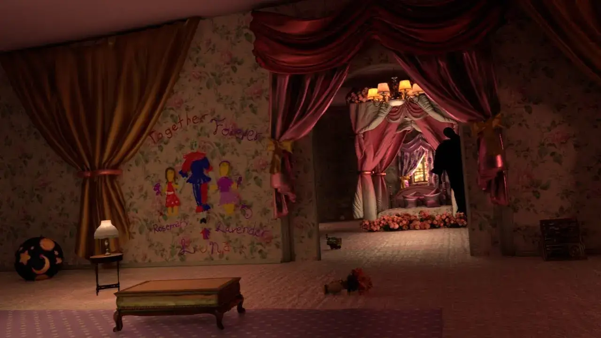
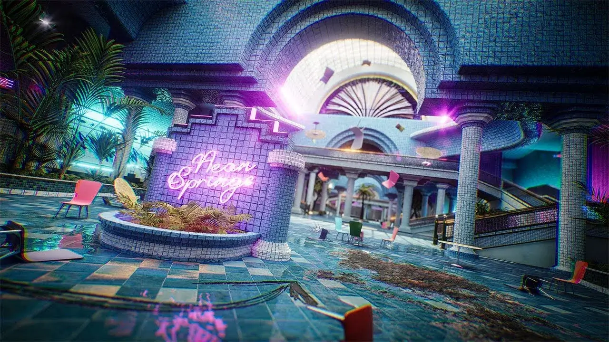

import { Aside } from 'astro-pure/user'

<Aside type='tip' title='提示'>
本文首发于百度贴吧：https://tieba.baidu.com/p/9559721186  
不过本网站的排版更佳，更适合阅读，以下为正文内容
</Aside>

之前就比较喜欢看梦核相关的视频，不过直到今年一月初左右，才首次正式接触到了后室这个世界观，  
当时就感觉这个题材很有趣，于是最近这几个月陆续看了很多后室的视频，  
这次要推荐的就是其中非常优秀的一部，只是很遗憾国内看过这部电影的人似乎并不多，实在是明珠蒙尘。

这部电影截至到目前为止，共有十三集，主要出现了九个层级，  
分别为Level0变种、池核变种、草室走廊、无限花园之外、永恒郊区(小镇)、Rosemary之家(城堡)、游乐园、阈限酒店、霓虹泉迷失之梦，  
除了第一集由于是作者的练手之作导致画质较一般以外，其他的画面都很精细，远超大部分后室电影，  
特别是第四、五集的草廊花园和第十集末尾的花岛(如图)，美轮美奂到了甚至可以直接拿来做壁纸的级别，  
而且在第十集之后，作者开始使用虚幻引擎，特效效果进一步加强，第十二、十三集出现的“霓虹泉迷失之梦”这个层级，只能用“瑰丽”两个字来形容。

点击展开查看图片

同时在剧情设计方面，作者也摒弃了部分后室电影采用的“探索-遇到实体-逃命-探索”那种把所有实体都当作无脑怪物，时不时就贴脸吓唬一下观众的重复套路，  
而是选择大幅度减少实体出现的次数，基本上一集都不一定能见到一个实体，  
还给予了部分实体人性，导致出现了不少中立实体和友善实体，期间帮助主角渡过了多次危机，  
整部电影里面对主角有恶意的实体数量都不是很多，加上经常有墙上提示文字和友善实体的帮助，所以主角的生存压力其实并不是特别大，  
此电影把更多的镜头放在了对周围环境的观察上，让观众完整体验另一个世界的风景，整体倒是更像是一篇游记。

再谈一下主角本身，主角是个非常谨慎的人，经常回头观察环境(作者称之为偏执狂)，和一般后室电影里面喜欢作死的主角也很不一样，  
比如有一个细节，主角看见莫名其妙打开的门，会躲在门前的大柱子后观察一下确认安全了之后才会进去，就让人很有代入感。

本次推荐暂时就先写到这里了，  
如果有想看的，在B站或者油管搜索“Lost in the Hyperverse”就行，搜索结果第一条应该就是，  
也可点击下面的链接:  
油管：https://www.youtube.com/playlist?list=PLu8uWgUgGvQ2g0bW9DGqziQVwc8HlmJ2j  
B站(转载)：https://www.bilibili.com/video/BV1FD4y1E7eD/

有条件的话，个人建议最好还是到油管上面看，  
因为油管上面可以看到作者精心准备的字幕，里面有很多对这部电影里面细节的说明和解释，  
B站转载的则是缺了字幕，虽然多了其他观众的弹幕解读，但可能还是没有作者自己写的完整。  
另外这部电影目前剧情最有张力的部分，我个人认为应该是第六集，友善实体Rosemary小女孩的出现，把前面五集主角累积的不安全感几乎给一扫而空，同时APRF组织(应该就是小黄人组织)痕迹的连续出现，也能让观众看到希望。  
不过并不建议直接跳到第六集看，这样会少了很多乐趣。

