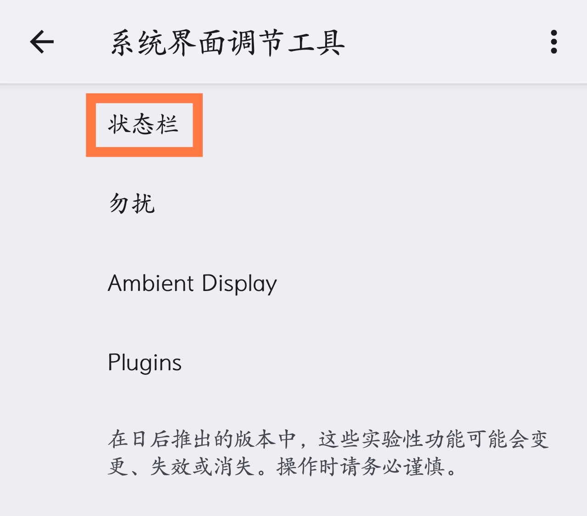
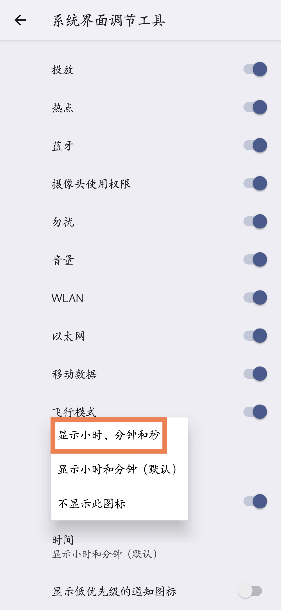
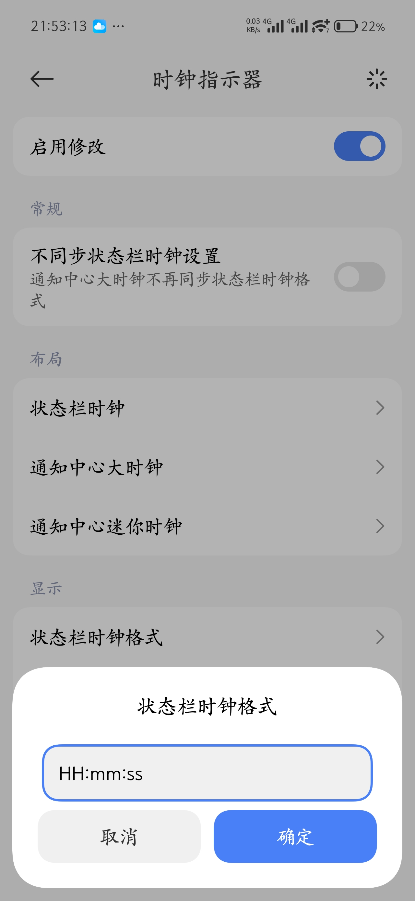
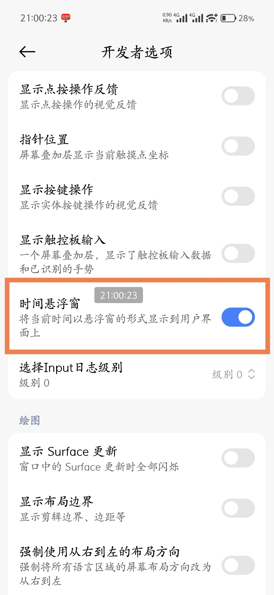
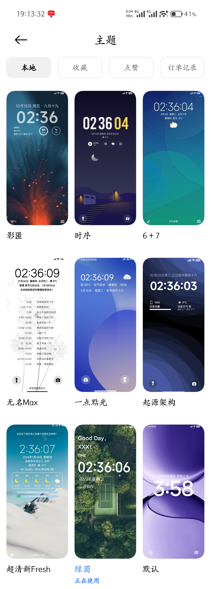
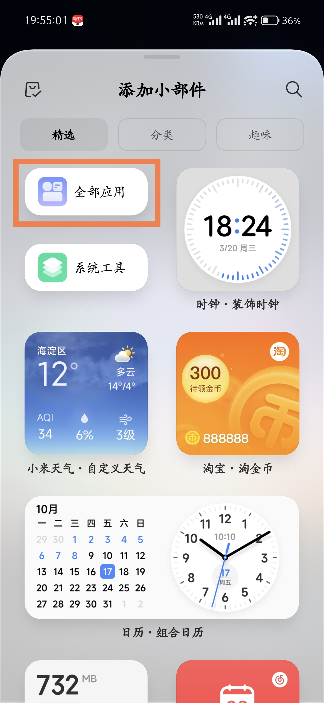
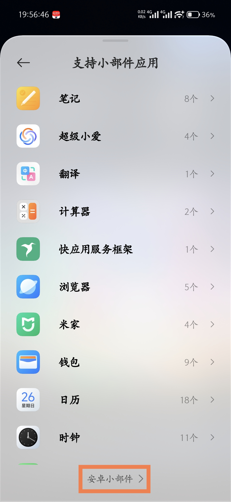
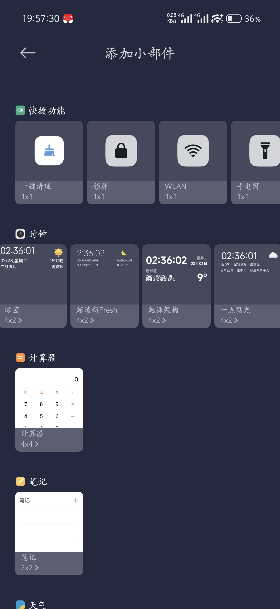

import { Collapse } from 'astro-pure/user'

目前大部分手机在状态栏显示的时间，基本都只显示了分钟而没有秒，让我这种有强迫症的人很难受，也不利于抢票和一些需要卡点的活动，  
所以下面我就来简单总结梳理一下让手机状态栏时间显秒的各种方法，希望能帮到有需要的人，
 
第一种方法，是通过安卓原生自带的系统界面调节工具进行设置，  

你只需要如上面两张图所示，  
先进入安卓原生的系统界面调节工具，  
再依次点击“状态栏”和“时间”选项，  
最后选择“显示小时、分钟和秒”这一项就行了，  
看上去是不是就和把大象放进冰箱里面一样简单，  
但由于国内主流的手机厂商，基本都在自己的系统里面隐藏或删除了这个系统界面调节工具的入口，  
因此大部分人应该都很难直接找到这个系统界面调节工具，  
所以这里推荐使用“爱玩机工具箱”或“安卓快捷设置”之类的应用来进入系统界面调节工具进行设置，  
这个方法的好处是不需要root权限也不需要连接电脑，缺点则是对于不少深度魔改的系统无效(比如楼主目前在用的HyperOS3)。  

第二种方法，是通过ADB指令进行设置，需要连接电脑，  
通过“搞机工具箱”、“紫罗兰工具箱”之类的很多软件都可以设置，无需赘述，  
这个方法的好处，是同样不需要root权限，而且适用系统的范围，比上面通过安卓原生的系统界面调节工具要大一些，但仍然对于部分系统无效(比如HyperOS3)。  

第三种方法，自然就是终极的通过root权限来进行修改了，只要借助合适的模块，几乎任何基于安卓的系统都能实现，  
以HyperOS3为例，获取临时root权限后，安装HyperCeiler模块并打开，依次点击“系统界面”、“状态栏”、“时钟指示器”、“状态栏时钟格式”，输入“HH:mm:ss”，勾选启用修改，然后再重启“系统界面”就可以看到状态栏的时间显秒了。

顺便提一下，如果你只是偶尔抢票或者抢购商品，临时需要时间显秒功能，但我上面列出的前两个方法都用不了，还没有root权限，  
那可以用这个方法，先连续点击系统版本号打开开发者选项，然后在开发者选项里面打开“时间悬浮窗”功能即可，  

这个时间悬浮窗显示的时间也是有秒数的，而且能自由拖动位置始终显示在最上层，所以可以在任何界面显示，  
尽管可能不是很美观，但临时使用绝对是足够了的。

以上就是我找到的手机设置状态栏时间显秒的所有方法了，如果你还有其他我不知道的方法，欢迎在评论区补充。

<Collapse title='顺便再谈一下让桌面和锁屏界面的时间显秒的方法'>  
这个按理来说其实是应该比让状态栏时间显秒要简单很多，因为理论上只需要在自己系统的主题商店里面，选择一个带时间显秒的主题或时间小部件就行，  
但我实际操作起来，在这一步上面花的时间，要比在设置状态栏显秒上面花的时间多了十几倍，  
主要的原因是带时间显秒的主题实在有点少，而且还没办法精确搜索，  
所以只能在主题商店里面随机乱翻，翻了一个多小时也就看到了如下图所示的这七八个主题，  

而且我在添加时间小部件过程中，还发现了HyperOS3一个非常坑的地方，  
正常来说，用户在主题商店里面选择应用一个主题之后，系统默认的这个时钟小部件，是应该同步被更换为这个主题的时钟小部件样式的，  
但HyperOS3居然不是这样，不管我怎么切换主题，系统默认的时钟小部件样式就没有变过，  
刚开始我还以为是我选的主题有问题，结果换了几个不同主题都一样，而且我在HyperOS3的时钟分类小部件里面，也完全找不到当前主题对应的时间小部件样式，  
折腾了半天都不行，本来我都已经放弃了，结果后面我在尝试添加To Do的待办列表小部件的时候，才发现HyperOS3的小部件精选分类里面有一个“全部应用”，

点进去里面最底下有很小的一行字“安卓小部件”，

再点进去才会发现，原来主题的时间小部件都藏在了这里面，  

只能说基于安卓的HyperOS3是确实很想切割安卓了，装模作样的搞一个安卓小部件分类，还藏这么深，不知道的还以为HyperOS3不是安卓呢，  
不过能把自家主题商店的主题小部件放到安卓小部件里面也是让人无语了，害得我找了半天。
</Collapse>

