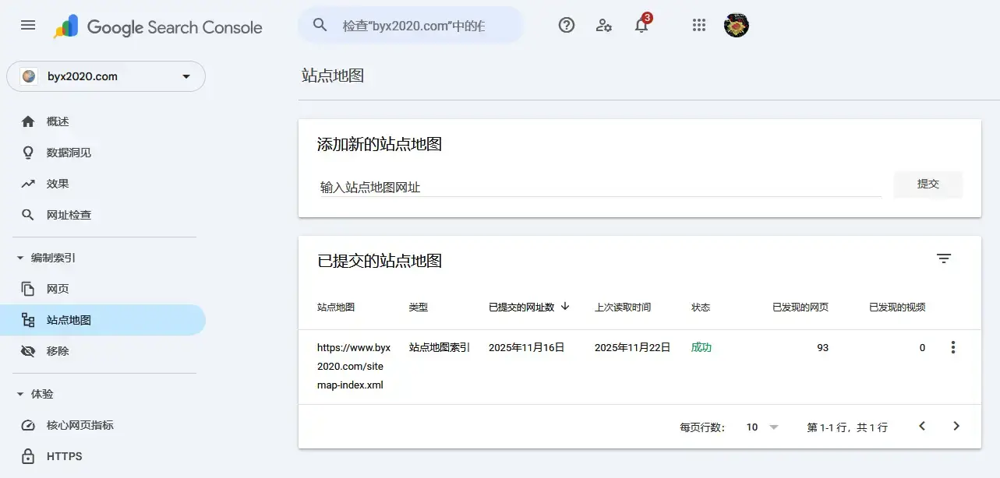
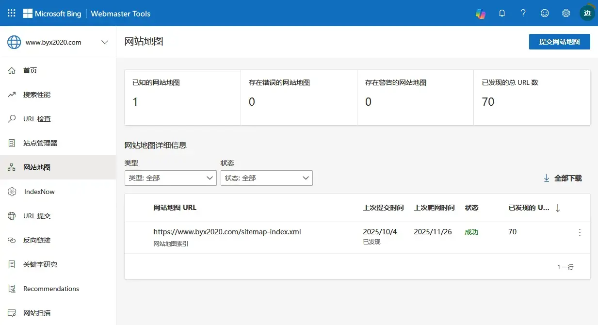
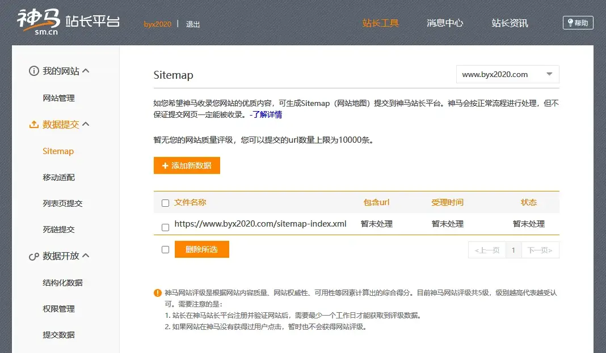
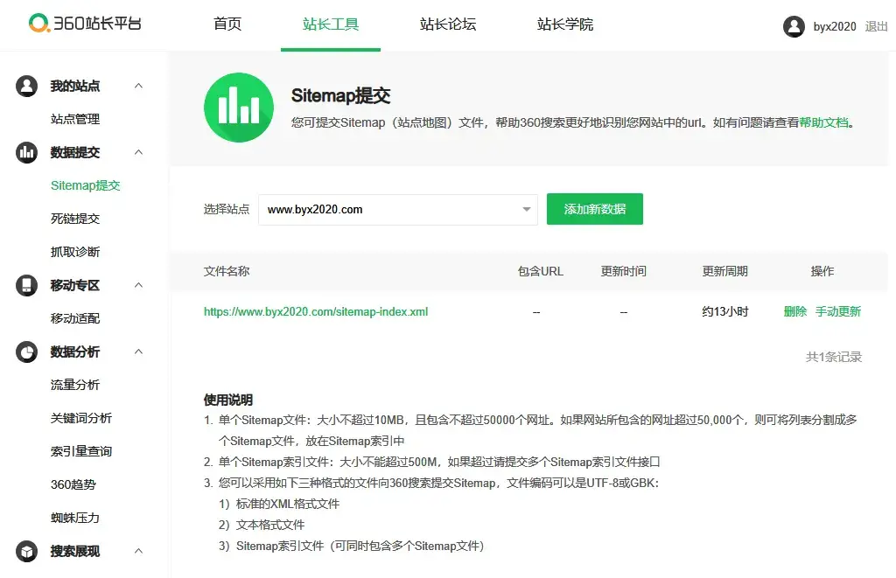
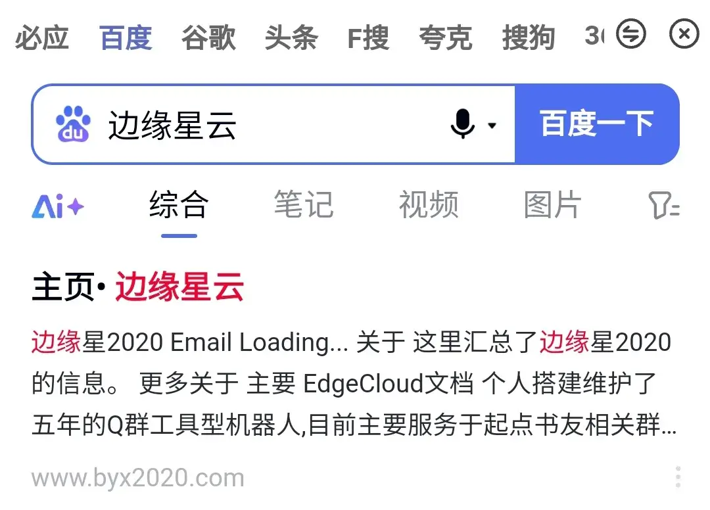
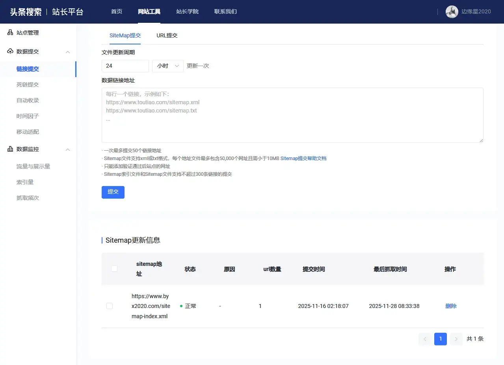
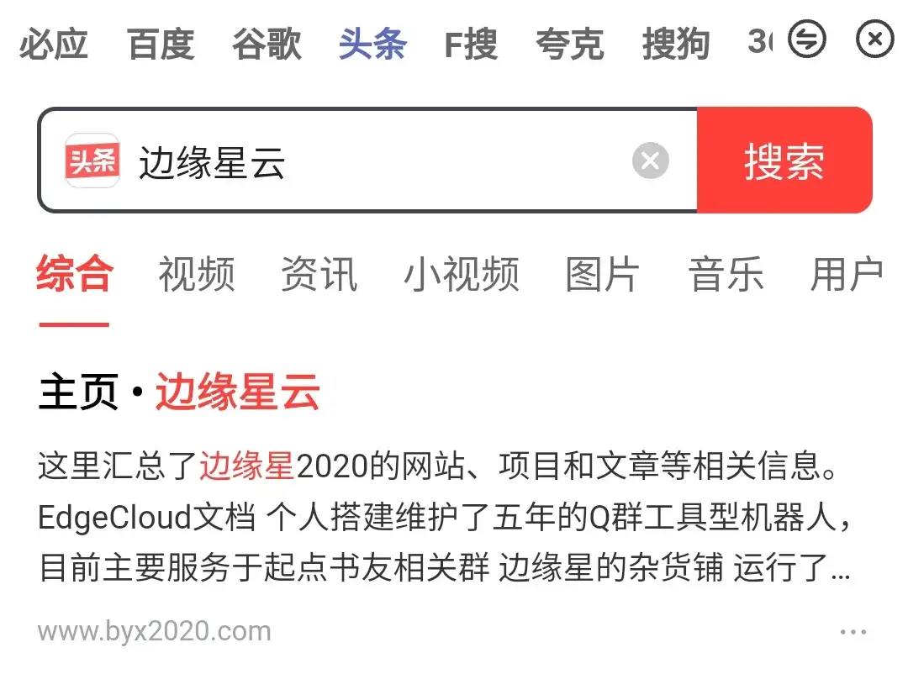

import { Collapse } from 'astro-pure/user'

随着AI大模型的兴起和普及，如今不少人需要搜索都是直接去问AI，而非使用传统搜索引擎了， 

不过即便如此，搜索引擎的作用仍然不可替代，毕竟大部分AI联网搜索的信息来源其实主要还是搜索引擎， 

所以前段时间，我也去尝试将自己个人网站的链接提交到各大搜索引擎，看看它们对于个人网站的收录情况如何，

这次我主要测试了七个搜索引擎，前三个自然是必不可少的Google(谷歌)、Bing(必应)和百度，

另外四个则相对冷门一些，分别是腾讯系的搜狗搜索(支持微信公众号)、阿里系的神马搜索(主攻移动端浏览器)、字节系的头条搜索和部分人喜欢用的360搜索，

以下为我提交链接半个月后，各大搜索引擎对我个人网站链接的收录情况：

| **搜索引擎** | **Sitemap提交链接** | **网站收录状态** | **网站链接收录数量** |
|---|---|---|---|
| Google搜索 | 支持 | 成功 | 90 |
| Bing搜索 | 支持(可自动嗅探) | 成功 | 70 |
| 百度搜索 | 仅限备案网站支持 | 成功 | 1 |
| 头条搜索(字节系) | 支持 | 成功 | 1 |
| 搜狗搜索(腾讯系) | 不支持 | 失败 | 0 |
| 神马搜索(阿里系) | 支持 | 失败 | 0 |
| 360搜索 | 支持 | 失败 | 0 |

从上表里面可以看到，Google和Bing对于个人网站的收录是最友好的，不仅收录数量多，而且收录速度也比较快，只能说难怪是全球使用最广泛的两大搜索引擎，  

此外Bing还支持自动嗅探网站的Sitemap链接，只需要把网站的主域名提交给Bing，Bing就会自动寻找网站的Sitemap并收录，这点做得非常好，值得其他搜索引擎学习，

再看国内的搜索引擎，就要差了一大截，  
其中的搜狗搜索都2025年了居然还不支持Sitemap提交，也不知道是怎么想的，
  
至于收录情况，因为我的个人网站没去备案，所以本来就没抱太大希望，百度搜索和头条搜索能够收录一条主站链接，算是意外之喜，  
不过后面一想，这两个能够收录其实也挺合理，毕竟一个是国内老牌第一，另一个是新兴搜索引擎，两者应该是都还有人在干活的，  
而卡在中间的搜狗、神马和360，我提交的链接过去了半个多月都还是待处理状态，感觉可能是都已经没什么人在维护了，

最后说一下，百度搜索和头条搜索两个比较特殊的点，  
百度搜索想要以Sitemap形式提交链接的话，需要网站备案才行，否则只能单条链接手动提交，
  
而且百度搜索似乎只会收录主站链接，其他子页面即便手动提交了也不会收录(不知道是因为没备案还是因为没氪金)，

头条搜索的站长平台网页，需要关闭代理软件之后才能正常打开访问，  
而且头条的爬虫似乎会被CloudFlare的防护机制给挡住，所以如果你的网站使用了CloudFlare相关的服务，需要注意手动把头条搜索的爬虫IP或者标识给加入白名单，  
否则即便提交了Sitemap链接，也无法正常被头条搜索的爬虫给抓取收录，  

另外头条搜索似乎也只会收录主站链接，其他子页面不会收录，可能国内搜索引擎对于小个人网站都是这样吧。

<Collapse title='附：以上各搜索引擎站长平台链接'>
Google搜索站长平台：https://search.google.com/search-console

Bing搜索站长平台：https://www.bing.com/webmasters

百度搜索站长平台：https://ziyuan.baidu.com/dashboard/index

头条搜索站长平台：https://zhanzhang.toutiao.com/page/inner/site/manage

搜狗搜索站长平台：https://zhanzhang.sogou.com/index.php/sitelink/index

神马搜索站长平台：https://zhanzhang.sm.cn/open/detialPage

360搜索站长平台：https://zhanzhang.so.com/sitetool/sitemap
</Collapse>

