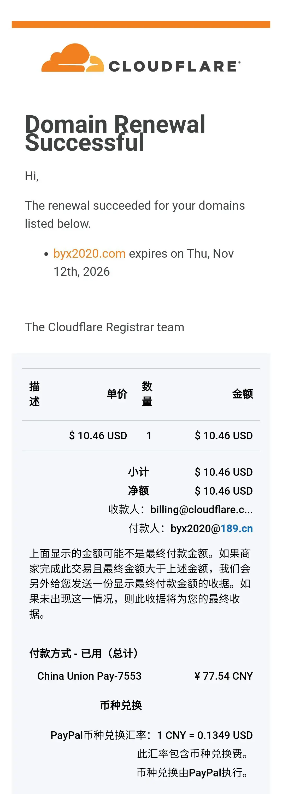
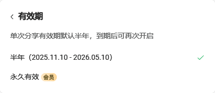
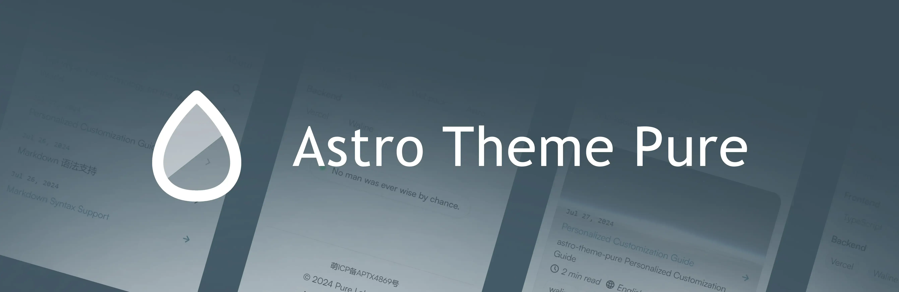
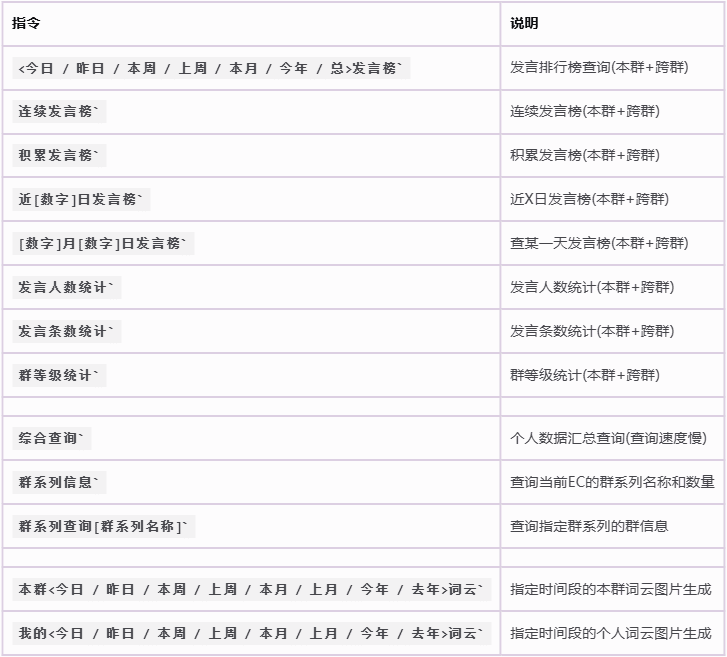
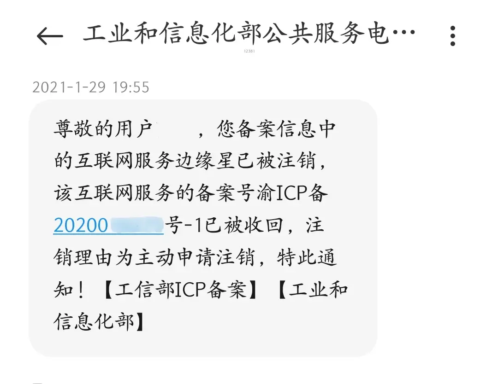

import { Aside } from 'astro-pure/user'

前段时间，我又收到了域名自动续费成功的通知邮件，  

看着约80元/年的账单和四五年没更新过的网站，  
最终还是决定得把这个域名真正利用起来，不然总感觉有点亏。

虽然早在五年前我就搭建过一个个人网站，但当时完成部署后，就把它托管在Cloudflare Pages再也没管过。  
主要是一直没找到合适的用途，导致有网站和没网站没什么区别。

## 契机与目标：为什么是现在？

不过在今年年中，我搭建的QQ机器人[EdgeCloud](https://www.byx2020.com/docs-ec)（以下简称EC）终于完成了大部分功能的重构，下一步就是为它重写一个全新的文档。  

但此前使用了五年的语雀文档让我不太满意：  
一方面是样式支持无法满足需求，  
另一方面是语雀现在不开会员就不让文档永久公开了，每隔半年都得手动公开一次。

因此我决定趁这次机会，将EC的文档迁移到自己的网站上。

另一个驱动力来自于创作平台的不快。  
前段时间在小红书等平台发长文时，总是遇到字数限制和莫名其妙的屏蔽词问题（参考我的上一篇文章），用得也不太舒服。  
因此我决定把过去发布的一些长文在自己的网站上备份一份，同时以后发长文也先在自己网站放原稿，  
如果要发布到其他平台，再根据各个平台不同的限制和规则进行文章内容和排版样式的调整。

至此，网站的两个核心使用场景终于明确了：**作为EC的项目文档站**，和**作为个人长文的备份平台**。

## 框架选择：Valaxy还是Astro？

确定了用途，接下来就是框架和主题的选择。  
我五年前的网站是基于[Hexo](https://hexo.io/zh-cn/)框架和[hexo-theme-yun](https://github.com/YunYouJun/hexo-theme-yun)主题构建的，在当时非常优秀。  

但在我没管网站的这几年里，技术也在迭代，`hexo-theme-yun`也迁移到了一个全新的框架——`Valaxy`。

[Valaxy](https://github.com/YunYouJun/valaxy)是新一代的静态博客框架，其开发者[@云游君](https://yunyoujun.cn/)，也正是我之前使用的`hexo-theme-yun`主题的作者。  
这个框架的诞生，源于他对`Hexo`框架局限性的思考，并借鉴了众多现代框架的优秀设计。  
因此`Valaxy`相较于其他静态博客框架具有多种优势，这一点在其官方文档[《为什么选择Valaxy》](https://valaxy.site/guide/why)中有详细的介绍。

所以我在仔细阅读完`Valaxy`的文档后，最终选择了使用群岛架构、泛用性更强的`Astro`框架，原因很简单：

1.  需求特殊：这次重构，我主要的需求是给EC存放文档，未来大概率也不会专注于博客。我需要的是一个“文档站 + 博客”的混合体，而`Valaxy`现有的主题和插件并不能很好地满足我这个非主流需求。
2.  精力有限：而让我自己来设计开发新的主题，先不提我有没有这样的能力，即便我拥有相应的代码水平，但在这上面花费太多的精力和时间，也是违背了我重建网站的初衷，毕竟光是机器人EC那边，都还有一堆功能bug和说明文档等着我去修改和编写，实在不想再花太多时间在网站上面。

因此，我选择了[Astro](https://github.com/withastro/astro)框架搭配由[@CWorld](https://cworld0.com/)开发的[astro-theme-pure](https://github.com/cworld1/astro-theme-pure)主题。  

这个主题风格与Yun主题很相似，同样轻量简洁功能齐全，  
最重要的是它自带了文档页面，直接改改就能用，能节省我很多时间。

<Aside type='note' title='笔记'>
当然，如果你只想专注于博客，或者具备一定的代码水平，  
我个人仍然非常推荐使用[Valaxy](https://github.com/YunYouJun/valaxy)，因为它确实是一个相当出色的新框架，具有顶级的性能和页面一致性等，  
这次也只是我个人的需求比较特殊，才没有选择`Valaxy`。
</Aside>

## 踩坑实录：从实现到部署

框架和主题确定后，便开始了复刻项目并部署，  
陆陆续续花了大半个月的时间，基本完成了大部分EC文档的重构和少部分其他平台文章的迁移，  
顺便也对部分主题样式进行了一些修改调整，这个反而花的时间要更多一些，  
因为我不是程序猿代码水平堪忧，而想修改的地方又比较多，所以弄出过不少问题，

另外还遇到了一个特别坑的事情，其实也是我强迫症犯了自作自受，  
之前把问题差不多解决完了之后，没事干把主题依赖全部更新到了最新，  
结果导致网站出现了mdx网页单行代码块最右边能够看到一个\`反引号符的bug（如下图所示），  

当时我还以为是自己改的代码又改出了问题，反复回档测试了两三天死活找不到原因，结果最后才发现应该是依赖的问题， 
其实正常问题到这里就结束了，回档依赖就可以解决，但我强迫症又犯了，就是想要更新依赖，  
于是又花了一天时间在更新的上百个依赖挨个测试(现在回想只觉得很傻)，  
最后才确定了是[unocss@66.5.4](https://github.com/unocss/unocss/releases/tag/v66.5.4)的问题，只要把依赖更新到了这个版本就会出现单行代码块最右边能够看到一个\`反引号符的bug， 

只能说没事不要随便升级依赖，虽然以前也看过不少类似的程序猿段子，但只有自己遇到了才知道有多难受，这次经历也大概算是治好了我的强迫症(并没有)，

## 部署策略与一些思考

再说一下个人网站部署平台的选择，我自己的话，不管是用阿里腾讯的云服务器自建，还是用Github和Cloudflare的Pages托管，都曾经使用过一年以上， 

不过我这次选择了之前没尝试过的、基于[enhanced-FaaS-in-China](https://github.com/xingpingcn/enhanced-FaaS-in-China)项目方案的Vercel和NetLify混合部署方式，  
优选IP之后的网站访问速度，也还算是在能够接受的范围之内，当然最重要的还是免费，就是NetLify的免费额度似乎有点低，

至于CDN，国内的话，网站不备案就基本不用考虑这个了，  
而且我感觉个人网站弄这个似乎也没什么意义，没什么人看的网站去套CDN，只会平白增加被dos攻击破产的风险，这些年在群里都看到不少的案例了，

另外说到备案，我也并不建议任何新手很草率的就决定去进行个人备案，  
你要知道，备案后任何人都能通过你的备案号非常简单的查到你的真名实姓，除非你已经做好了公开实名上网的准备， 

<Aside type='note' title='笔记'>
这个坑我五年前也是踩过的，刚开始折腾这些的时候我是直接抄了云游君的作业，  
不仅买了不需要备案就能实名上网的cn域名，还一次性就备案成功通过了……  
后来才意识到，别人是大佬当然无惧实名上网，我也这样干，就和抄作业把姓名和学号都抄下来没什么区别，  
所以后面就注销了备案和cn域名，相当于白折腾了一趟，  

最后把主域名换成了[byx2020.com](https://www.byx2020.com)一直使用到现在。
</Aside>

虽然我在互联网上也算信息比较“公开”的类型了（各平台基本同名同头像），但我仍然不太能接受备案这种“真名上网”。  
总之，想备案的人一定要先了解清楚这一点，免得备案完才后悔，重蹈我的覆辙。

---

写到这里大概差不多了，个人文笔有限，感觉又写成了流水账，最后感谢一下能够坚持完整看到这里的观众，  
另外，本来这篇和上一篇应该是一篇文章，但写着写着就发现字数又六七千了。  
因此考虑了一下，还是按主题拆分成了两篇，有兴趣的也可以看看我的前一篇文章[《挣脱平台束缚：2025年个人网站的作用与意义》](https://www.byx2020.com/posts/website-role-2025)。

